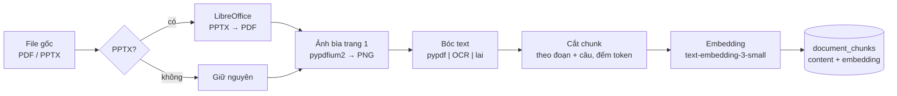
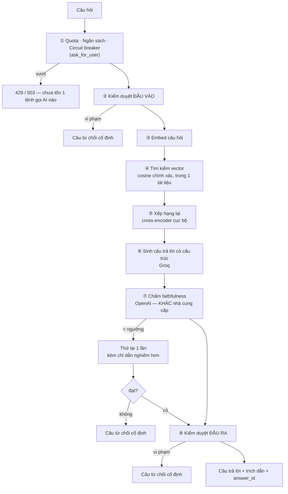

# Pipeline AI

> Mô tả đường đi của một câu hỏi từ lúc người dùng bấm gửi tới lúc nhận được câu trả lời có trích dẫn — và **vì sao** có ngần ấy chốt kiểm soát.
>
> Toàn bộ nằm ở [`app/services/rag_service.py`](../../app/services/rag_service.py). Không có microservice AI riêng.

---

## 1. Hai pipeline, không phải một

Dễ nhầm lẫn nếu chỉ nghĩ tới lúc hỏi. Thực tế có **hai** pipeline chạy ở hai thời điểm hoàn toàn khác nhau:

| | Pipeline nạp (indexing) | Pipeline hỏi (query) |
|---|---|---|
| **Khi nào** | Một lần, lúc tải tài liệu lên | Mỗi lần người dùng hỏi |
| **Đồng bộ?** | Không — chạy nền, mất hàng chục giây tới vài phút | Có — người dùng đang chờ |
| **Ở đâu** | `ingestion_service` + `ingestion_worker` | `rag_service.ask()` |
| **Sản phẩm** | Chunk + embedding nằm trong DB | Câu trả lời + trích dẫn |

Chất lượng pipeline hỏi **bị chặn trên** bởi chất lượng pipeline nạp: cắt chunk tệ thì không thuật toán retrieval nào cứu được.

---

## 2. Pipeline nạp



**Ba quyết định đáng chú ý:**

**PPTX được chuyển sang PDF chứ không đọc trực tiếp.** Một đường xử lý duy nhất cho mọi loại file, và trình duyệt cũng cần PDF để hiển thị. Đánh đổi: phụ thuộc LibreOffice cài sẵn trên máy chủ — một phụ thuộc hệ thống nặng, và các tiến trình `soffice` chạy song song từng tranh chấp profile mặc định.

**Ba chế độ bóc text, mặc định là chế độ rẻ nhất.** `pypdf` (miễn phí, chỉ lấy được text có sẵn) / `mistral_ocr` (đọc được cả hình, biểu đồ, slide dạng ảnh — tốn tiền) / `hybrid`. Người dùng chọn lúc tải lên. Mặc định `pypdf` vì phần lớn slide bài giảng đều có text thật.

**Ảnh bìa render ở server, không phải ở trình duyệt.** Ban đầu frontend tự tải cả file PDF (có file 20MB) chỉ để hiện một ảnh nhỏ, và lặp lại mỗi lần mở dashboard. Chuyển sang render sẵn một lần lúc nạp: đo được **48ms cho file 21.6MB / 83 trang**.

---

## 3. Pipeline hỏi — bảy chốt

Đây là phần cốt lõi. Mỗi ô là một chốt có thể **dừng hẳn** luồng.



### ① Bảo vệ tài nguyên trước khi tiêu tiền

Đặt **đầu tiên**, trước cả kiểm duyệt, vì đây là chốt duy nhất không tốn lệnh gọi AI nào. Ba lớp khác nhau về phạm vi:

- **Quota theo ngày** — chặn một người dùng xài quá nhiều
- **Ngân sách theo tháng** — chặn theo tiền thật, vì số câu hỏi không tỉ lệ thuận với chi phí
- **Circuit breaker** — chặn **toàn hệ thống** khi có dấu hiệu bất thường đột biến; kiểm tra **trước** quota vì nó bảo vệ mọi người, không riêng ai

### ② và ⑧ Kiểm duyệt hai chiều

Đầu vào sạch **không đảm bảo** đầu ra sạch: tài liệu người dùng tải lên có thể chứa nội dung không phù hợp và bị trích ra ngoài ý muốn. Nên phải kiểm cả hai đầu.

Cả hai đều trả về **cùng một câu từ chối cố định**, giống mọi trường hợp từ chối khác. Nếu thông điệp khác nhau, người dùng dò được đâu là ranh giới kiểm duyệt và đâu là "không có trong tài liệu".

### ③④ Truy hồi — và chuyện không có index

Câu hỏi được embed rồi so cosine với chunk của **đúng tài liệu đang mở**.

Điểm phản trực giác: **không có index vector nào cả**. Index `ivfflat` ban đầu (`lists=100`) làm **6/43 câu golden dataset trả về 0 kết quả** — mất 14%, âm thầm, vì `lists=100` được tinh chỉnh cho hàng chục nghìn dòng còn thực tế chỉ có hàng trăm. Đã xoá hẳn index thay vì tinh chỉnh lại: ở quy mô này quét tuần tự vừa nhanh vừa **chính xác tuyệt đối**, và luôn có `WHERE document_id = ...` (có index btree) giới hạn phạm vi.

Bài học tổng quát: **index xấp xỉ (ANN) đánh đổi độ chính xác lấy tốc độ — và ở quy mô nhỏ thì bạn trả giá mà không nhận được gì.**

### ⑤ Xếp hạng lại — bước cải thiện nhiều nhất

Lấy nhiều ứng viên bằng vector search rồi cho **cross-encoder đa ngôn ngữ** chấm lại từng cặp (câu hỏi, chunk).

Vì sao hiệu quả: vector search so **hai embedding đã nén sẵn, độc lập với nhau**; cross-encoder đọc **cả câu hỏi và đoạn văn cùng lúc** nên bắt được liên hệ tinh tế hơn. Đo trên dữ liệu thật: **Recall@6 từ 0.837 → 0.953, MRR 0.715 → 0.900**.

Đánh đổi: chậm hơn nhiều nên chỉ chấm lại được vài chục ứng viên, và model chạy cục bộ ⇒ tốn RAM/CPU của chính server.

### ⑥ Sinh câu trả lời có cấu trúc

Model **không** trả về văn bản tự do. Nó trả về cấu trúc `AnswerSegment[]`, mỗi đoạn kèm `page_number`.

Trước đây trích dẫn được lấy bằng **regex quét chuỗi `"[Trang X]"`** trong văn bản — cách này hỏng ngay khi model đổi cách viết đôi chút. Structured output biến trích dẫn từ *"đoán từ văn bản"* thành *"dữ liệu có kiểu"*.

Câu trả lời cuối cùng được **ghép lại từ các segment**, còn `citations` **dựng thẳng từ `page_number`** — không còn parse chuỗi ở bất kỳ đâu.

### ⑦ Chấm faithfulness — trọng tâm của "không bịa"

Một LLM thứ hai đọc `(ngữ cảnh, câu trả lời)` và chấm điểm mức độ câu trả lời **thật sự dựa trên ngữ cảnh**.

**Giám khảo cố ý dùng nhà cung cấp khác** với bên sinh câu trả lời (OpenAI chấm, Groq sinh). Cùng một model vừa viết vừa tự chấm sẽ có thiên kiến hệ thống — nó không nhìn ra lỗi của chính nó.

Dưới ngưỡng thì **thử lại một lần** với chỉ dẫn nghiêm hơn; vẫn không đạt thì thay hẳn bằng câu từ chối. Chọn "thà im lặng còn hơn nói sai" — với gia sư học tập, một câu bịa nghe hợp lý còn tai hại hơn câu "tôi không tìm thấy trong tài liệu".

---

## 4. Quan sát: mọi lệnh gọi AI đều để lại dấu vết

```
ask() sinh 1 call_group_id duy nhất
        │
        ├──▶ ai_call_log   mỗi LỆNH GỌI (moderation, embed, sinh, chấm, thử lại)
        │                   ghi ngay lúc xảy ra: model, độ trễ, token, chi phí, prompt_version
        │
        └──▶ ai_usage_log  mỗi LƯỢT HỎI, ghi ở cuối
                    │
                    └──▶ answer_feedback   👍/👎 của người dùng
```

Nhờ nối được ba bảng này mà trả lời được câu mà hầu hết hệ thống RAG không trả lời nổi: **"phiên bản prompt mới có thật sự tốt hơn không?"** — so cùng lúc điểm faithfulness tự động, chi phí, và đánh giá thật của người dùng theo từng `prompt_version`.

`prompt_version` còn được **kiểm tra tự động bằng hash**: sửa prompt mà quên tăng version thì hệ thống báo lỗi ngay, không để số liệu hai phiên bản trộn lẫn.

---

## 5. Đã thử, đo, và KHÔNG dùng

Phần này quan trọng ngang phần đang chạy — nó cho thấy **kỹ thuật nổi tiếng không tự động là kỹ thuật đúng cho bài toán của mình**. Tất cả đều còn code trong repo nhưng **không được nối vào `ask()`**:

| Kỹ thuật | Vì sao không dùng |
|---|---|
| **Hybrid search** (BM25 + vector) | Không cải thiện đo được trên bộ dữ liệu này |
| **Query transformation / multi-query** | Tốn thêm lệnh gọi LLM cho mỗi câu hỏi, chất lượng không tăng tương xứng |
| **Semantic caching** | Rủi ro trả nhầm câu trả lời của câu hỏi *gần giống* lớn hơn lợi ích tiết kiệm |
| **Scope enforcement bằng ngưỡng similarity** | Đo thật cho thấy **không tách biệt an toàn** — câu ngoài phạm vi kiểu *"1+1 bằng mấy?"* lại có similarity **cao hơn** câu hỏi hợp lệ |
| **Rerank API ngoài** (Voyage, Jina) | Voyage giới hạn 3 lượt/phút ở gói dùng thử; Jina độ trễ dao động tới 51 giây. Reranker cục bộ thắng về độ ổn định |

---

## 6. Chưa có

| Thiếu | Hệ quả | Ở đâu trong kế hoạch |
|---|---|---|
| **Hiểu ngữ cảnh nhiều lượt** | Hỏi *"giải thích rõ hơn phần đó"* sẽ retrieval sai, vì câu hỏi tự nó không đủ thông tin | [Phase 6](../development-plan/phase-6-chat-sessions.md) bước 6.7 |
| **Streaming** | Chờ im lặng vài giây rồi mới thấy toàn bộ câu trả lời | [Phase 7](../development-plan/phase-7-streaming.md) |
| **Highlight nguồn trên viewer** | Auto-jump + chip trang + rect bbox (null → fallback trang) | [Phase 8](../development-plan/phase-8-citation-highlight.md) ✅ |
| **Fallback nhà cung cấp LLM** | Groq gỡ model là hệ thống đứng — đã xảy ra 2 lần lúc phát triển | Ghi nhận, ưu tiên thấp |

**Không có agent, không có tool calling, không có bộ nhớ dài hạn.** Đây là RAG một lượt, có kiểm chứng. Sự đơn giản đó là cố ý: mỗi chốt trong sơ đồ đều đo được và giải thích được, thứ mà kiến trúc agent nhiều bước rất khó đạt.

---

## 7. Đọc tiếp

- [`data-flow.md`](data-flow.md) — dữ liệu biến đổi qua từng chặng
- [`explain-logic/phase-5.5-advanced-rag/`](../explain-logic/phase-5.5-advanced-rag/README.md) — số liệu đo cho từng kỹ thuật retrieval
- [`explain-logic/phase-5.6-guardrails-observability/`](../explain-logic/phase-5.6-guardrails-observability/README.md) — từng chốt guardrail
