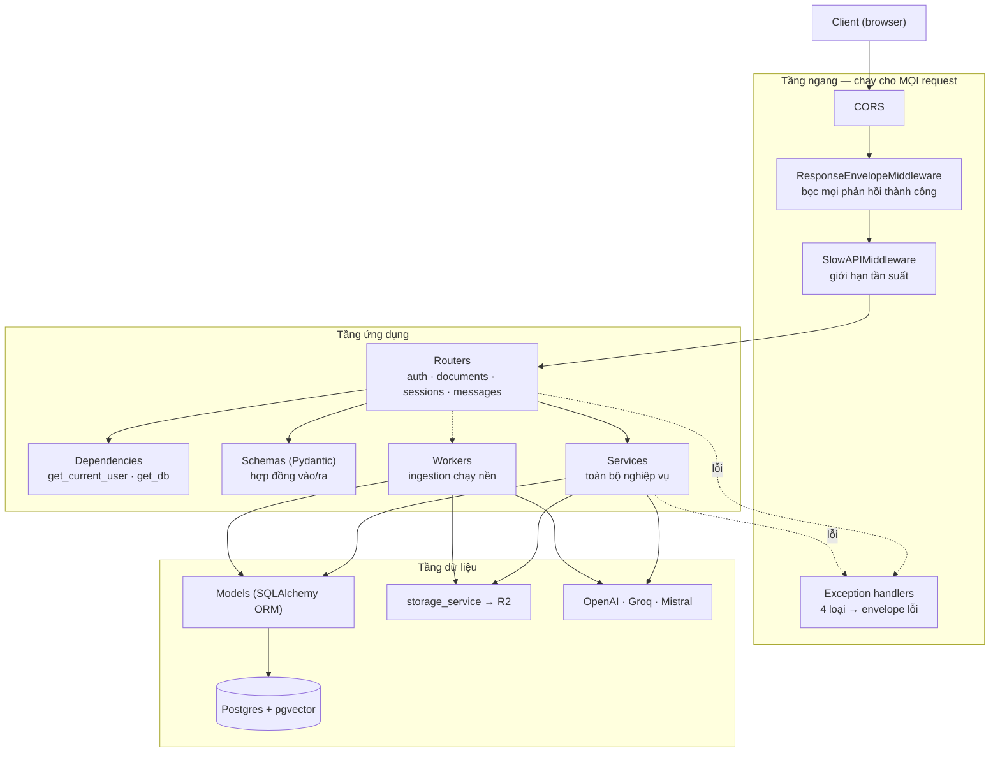

# Kiến trúc backend

> Tài liệu này mô tả **cách chia tầng** của backend và **trách nhiệm của từng tầng**.
> Chỉ ghi những tầng **thật sự tồn tại** trong code — phần nào cố ý không có cũng được nói rõ, vì "không có tầng X" cũng là một quyết định kiến trúc.

---

## 1. Bản đồ tầng



Nguyên tắc xuyên suốt: **request đi xuống, lỗi đi lên bằng exception**. Service không bao giờ trả về mã HTTP; service ném exception nghiệp vụ, router dịch sang HTTP. Nhờ vậy service dùng lại được ở nơi không có HTTP — và đó không phải giả thuyết: các script đánh giá offline trong `app/evaluation/` gọi thẳng service.

---

## 2. Từng tầng làm gì

### 2.1 Middleware — việc phải làm cho mọi request

Ba middleware, thứ tự khai báo có ý nghĩa (FastAPI chạy ngược thứ tự `add_middleware`).

| Middleware | Trách nhiệm | Vì sao đặt ở tầng này thay vì viết trong từng router |
|---|---|---|
| `CORSMiddleware` | Cho phép frontend khác origin gọi API | Chính sách toàn cục, không phải chuyện của từng endpoint |
| `ResponseEnvelopeMiddleware` | Bọc **mọi** phản hồi thành công vào `{success, message, data, error, requestId}` | Viết tay ở từng endpoint thì chỉ cần một chỗ quên là client gặp hai hình dạng khác nhau. Middleware làm cho việc quên trở nên **bất khả thi** |
| `SlowAPIMiddleware` | Hạ tầng cho giới hạn tần suất | Bản thân middleware chỉ dựng sẵn; endpoint nào cần thì gắn `@limiter.limit(...)` — hiện đang gắn ở đăng nhập/đăng ký |

**Cái giá của response envelope** (cần biết vì nó từng gây lỗi thật): hình dạng JSON thực tế trên dây **không giống** `response_model` khai trong router. Người viết client mà chỉ đọc `response_model` sẽ đọc nhầm `data.access_token` trong khi giá trị thật nằm ở `data.data.access_token`. Frontend giải quyết bằng một interceptor bóc vỏ ở đúng một chỗ.

Lỗi đi đường **khác**: 4 exception handler ở `app/exceptions.py` tự sinh envelope lỗi riêng `{success:false, message, error:{code, details}, requestId}`. Nghĩa là **thành công và thất bại có hai hình dạng khác nhau**, client phải xử lý cả hai.

### 2.2 Routers — lớp biên HTTP

Ở `app/routers/`. Mỗi router chỉ làm đúng bốn việc:

1. Khai báo đường dẫn, method, `response_model`
2. Nhận phụ thuộc qua `Depends` (`get_current_user`, `get_db`)
3. Gọi **một** hàm service
4. Dịch exception nghiệp vụ → `HTTPException` với mã và thông điệp phù hợp

Router **không** chứa truy vấn DB, không gọi API bên ngoài, không tính toán nghiệp vụ. Kiểm chứng nhanh: `sessions.py` không import gì từ `sqlalchemy` ngoài kiểu dữ liệu.

> **Về "Controller":** dự án này **không có** tầng controller riêng. Trong FastAPI, hàm gắn decorator `@router.get(...)` đã đóng luôn vai trò controller. Thêm một tầng controller nữa chỉ tạo ra lớp chuyển tiếp rỗng.

### 2.3 Dependencies — cắt ngang nhưng có kiểu

`app/dependencies.py` cung cấp `get_current_user`: đọc `Authorization: Bearer`, giải mã JWT, tải `User` từ DB, ném 401 nếu hỏng.

Vì sao là dependency chứ không phải middleware: **không phải endpoint nào cũng cần đăng nhập** (đăng ký, đăng nhập, health thì không), và endpoint cần thì lại muốn nhận thẳng đối tượng `User` đã có kiểu. Middleware chạy cho tất cả và chỉ nhét được dữ liệu vào `request.state` không có kiểu.

### 2.4 Schemas — hợp đồng, không phải bản sao của model

`app/schemas/` chứa các lớp Pydantic. Chúng **cố ý khác** model ORM:

- `SessionResponse` **không** trả `user_id`, dù model có — người gọi chính là chủ, trả thêm chỉ lộ id nội bộ
- `MessageCitationResponse` cho phép `chunk_id` null, còn `CitationResponse` của `/ask` thì không — vì hai nguồn dữ liệu khác nhau
- `role` khai `Literal["user","assistant"]` để kéo ràng buộc từ DB lên tới OpenAPI

Nếu schema chỉ là bản sao y hệt model thì nó vô dụng; giá trị của nó nằm ở chỗ **chọn cái gì lộ ra ngoài và ràng buộc gì áp ở biên**.

### 2.5 Services — nơi chứa toàn bộ nghiệp vụ

| Service | Chịu trách nhiệm |
|---|---|
| `auth_service` | Băm mật khẩu, cấp/xác minh/thu hồi token |
| `document_service` | Kiểm tra loại và dung lượng file, quyền sở hữu tài liệu, xoá |
| `ingestion_service` | PPTX→PDF, bóc text (pypdf / OCR / lai), cắt chunk, tạo embedding, render ảnh bìa |
| `rag_service` | Toàn bộ pipeline hỏi đáp (xem [`ai-pipeline.md`](ai-pipeline.md)) |
| `usage_service` | Quota, ngân sách, circuit breaker, ghi log dùng AI, phản hồi 👍/👎 |
| `session_service` | Quyền sở hữu phiên + CRUD |
| `storage_service` | Bọc `boto3` cho R2 |

Hai điểm đáng học trong cách chia này:

**`storage_service` chạy boto3 trong threadpool.** `boto3` là thư viện chặn (blocking); gọi thẳng trong hàm async sẽ **đứng cả event loop** — nghĩa là mọi request khác của mọi người dùng khác bị treo trong lúc upload. Bọc `run_in_threadpool` là bắt buộc, không phải tối ưu.

**`rag_service` tách làm hai lớp.** `ask()` lo chất lượng câu trả lời, `ask_for_user()` bọc thêm quota/ngân sách/circuit breaker/ghi log. Endpoint thật **phải** gọi `ask_for_user()`; gọi nhầm `ask()` sẽ lọt qua toàn bộ lớp bảo vệ chi phí mà không có lỗi nào báo ra.

### 2.6 Không có tầng Repository — và đó là lựa chọn

Service **truy vấn thẳng qua SQLAlchemy ORM**, không có tầng repository ở giữa:

```python
# session_service.py — service tự viết truy vấn
session = await db.scalar(
    select(ChatSession).where(ChatSession.id == session_id, ChatSession.user_id == user_id)
)
```

**Vì sao không tách repository:**
- SQLAlchemy async session **đã là** một lớp trừu tượng trên DB; bọc thêm một lớp nữa chủ yếu sinh ra hàm chuyển tiếp một dòng
- Lý do kinh điển để tách repository là "để đổi DB dễ dàng" — nhưng dự án này dùng `pgvector`, tức là đã **cố ý cột chặt vào Postgres**. Trừu tượng hoá cho một khả năng không bao giờ xảy ra là chi phí thuần
- Lý do thứ hai là "để test không cần DB" — dự án này chọn hướng ngược lại: kiểm chứng bằng DB thật, vì phần lớn lỗi thú vị nhất đã tìm ra đều nằm ở tầng DB (bug index ivfflat, `now()` đứng yên trong transaction)

**Cái giá phải trả, nói thẳng:** truy vấn nằm rải trong service, nếu cùng một truy vấn dùng ở nhiều nơi thì dễ bị chép lặp và trôi lệch nhau. Cách giảm nhẹ hiện tại là gom các truy vấn có quy tắc bảo mật vào **đúng một hàm** (`get_owned_document`, `get_owned_session`).

### 2.7 Models & Database

`app/models/` là các lớp SQLAlchemy `Mapped[...]`. Đáng chú ý:

- **Ràng buộc nằm ở DB, không chỉ ở Python:** `CheckConstraint`, `UniqueConstraint`, và các FK có `ondelete` rõ ràng. Xoá một session thì Postgres tự dọn message + citation, code không phải xoá tay
- **Trigger `updated_at`** cho `users`, `documents`, `chat_sessions` — nhưng chỉ bắn khi **chính dòng đó** bị UPDATE, một chi tiết đã từng gây hiểu nhầm
- **`metadata` kiểu JSONB** ở `documents`, `chat_sessions`, `chat_messages` — chỗ để thông tin phụ mà không cần migration mỗi lần thêm trường
- **Không có index vector.** Có chủ đích: index `ivfflat` ban đầu **trả sai 14% kết quả** nên đã bị xoá hẳn. Ở quy mô hiện tại, quét tuần tự trong phạm vi một tài liệu vừa nhanh vừa **chính xác tuyệt đối**

Migration bằng Alembic. Kết nối qua `asyncpg` (pooler của Supabase).

### 2.8 Workers — chạy nền, và giới hạn của nó

`app/workers/ingestion_worker.py` chạy qua `BackgroundTasks` của FastAPI.

**Nó thật sự là gì:** một coroutine chạy trong **cùng tiến trình** web server, sau khi response đã trả về. Không phải hàng đợi tác vụ.

**Hệ quả phải biết:**
- Server restart giữa chừng ⇒ **công việc biến mất vĩnh viễn**, không lỗi, không thử lại. Đã xảy ra thật một lần: một tài liệu kẹt ở `pending` mãi mãi
- Không có retry, không có theo dõi tiến độ ngoài cột `status`
- Tác vụ nặng tranh CPU với việc phục vụ request

**Vì sao vẫn chọn:** không thêm Redis/Celery/RQ vào hệ thống ở giai đoạn này. Đây là đánh đổi có ý thức, không phải bỏ sót — và là ứng viên hàng đầu để thay khi lên production thật.

---

## 3. Xác thực

```
đăng nhập → access token (JWT, 15 phút) + refresh token (30 ngày, LƯU TRONG DB)
                                                  │
    access token hết hạn → gọi /auth/refresh ─────┘
                                                  │
                        đăng xuất → xoá refresh token khỏi DB → thu hồi thật
```

Quyết định trọng tâm: **access token không lưu ở đâu cả** (JWT tự chứng thực, thu hồi không được — nên để hạn rất ngắn), còn **refresh token lưu trong DB** để đăng xuất thật sự có hiệu lực. Đây là cách cân bằng phổ biến giữa "không phải tra DB mỗi request" và "phải thu hồi được".

Phân quyền theo tài nguyên nằm ở service, không ở middleware, và tuân theo một quy tắc nhất quán: **"không tồn tại" và "không phải của bạn" trả về CÙNG một 404**. Phân biệt hai trường hợp sẽ để lộ id nào có thật.

---

## 4. Xử lý lỗi

| Loại | Nơi phát sinh | Thành gì |
|---|---|---|
| Exception nghiệp vụ (`SessionNotFoundError`, `QuotaExceededError`...) | Service | Router bắt và dịch sang mã HTTP tương ứng |
| `HTTPException` | Router | `http_exception_handler` → envelope lỗi |
| Lỗi hợp lệ hoá | Pydantic, trước khi vào router | `validation_exception_handler` → 422 kèm chi tiết |
| Vượt tần suất | SlowAPI | → 429 |
| **Mọi thứ còn lại** | Bất kỳ đâu | `unhandled_exception_handler` → **log đầy đủ stack trace**, trả về 500 chung chung |

Nhánh cuối là chỗ đáng học: log giữ lại đủ để debug, còn phản hồi ra ngoài **không tiết lộ gì** về cấu trúc bên trong. Mọi phản hồi lỗi đều kèm `requestId` để nối được log với sự cố người dùng báo.

---

## 5. Điểm yếu đã biết

Ghi ra để không tự huyễn hoặc rằng kiến trúc này đã tối ưu.

| Điểm yếu | Hệ quả | Khi nào phải xử lý |
|---|---|---|
| Background task không bền vững | Restart là mất việc | Trước khi lên production |
| Pipeline AI chạy chung tiến trình web | Một câu hỏi nặng giữ một worker vài giây | Khi lượng truy cập đồng thời tăng |
| Reranker cục bộ nằm trong tiến trình | Ảnh triển khai nặng, tốn RAM, khó scale ngang | Khi container hoá / scale |
| Không index vector | Quét tuần tự — hiện đủ nhanh vì luôn lọc theo 1 tài liệu | Khi số chunk mỗi tài liệu lớn hơn nhiều |
| Phụ thuộc một nhà cung cấp LLM | Groq đã đổi/gỡ model 2 lần lúc đang phát triển | Đã ghi nhận là rủi ro thật, chưa làm fallback |
| Truy vấn rải trong service | Dễ chép lặp, trôi lệch | Theo dõi; hiện giảm nhẹ bằng các hàm `get_owned_*` |

---

## 6. Đọc tiếp

- [`system-overview.md`](system-overview.md) — bức tranh tổng thể và các phụ thuộc
- [`ai-pipeline.md`](ai-pipeline.md) — chi tiết pipeline hỏi đáp
- [`data-flow.md`](data-flow.md) — dữ liệu biến đổi qua từng chặng
- [`explain-logic/`](../explain-logic/README.md) — lý do đằng sau từng bước triển khai
