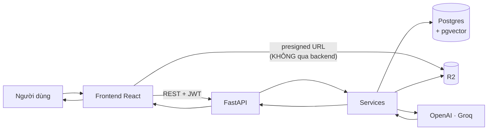
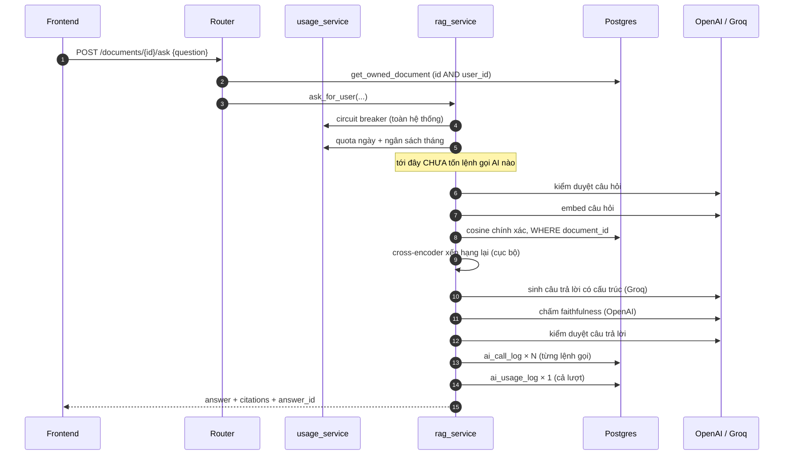
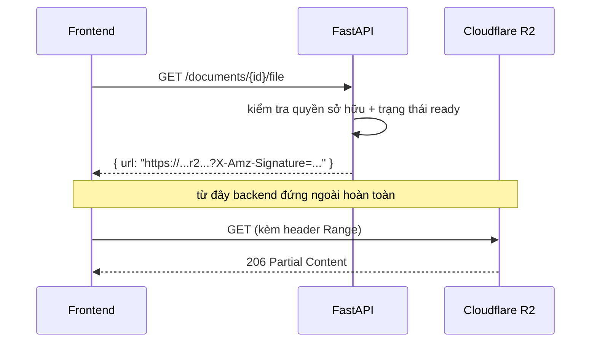
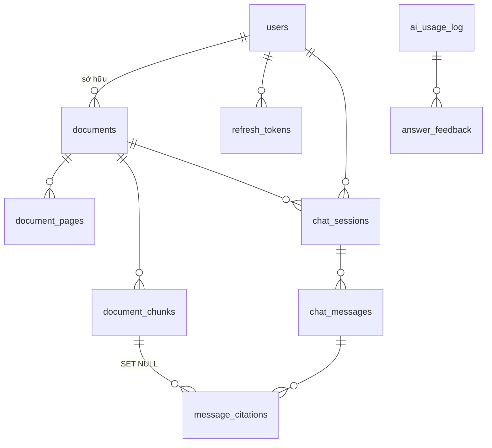

# Luồng dữ liệu

> Tài liệu này theo dõi **dữ liệu di chuyển và biến đổi thế nào** qua hệ thống, không mô tả từng file mã nguồn.
> Câu hỏi cần trả lời: *dữ liệu vào ở đâu, ai chạm vào nó, nó nằm lại ở đâu, và ai đọc ra.*

---

## 1. Bản đồ tổng



Chi tiết dễ bỏ sót: **có hai đường xuống R2**. Backend ghi file; frontend đọc file **trực tiếp** bằng URL đã ký. Nghĩa là backend không bao giờ phải làm proxy cho dữ liệu nặng — nhưng cũng có nghĩa là **quyền truy cập file phụ thuộc vào thời hạn của URL** (1 giờ), chứ không phải vào JWT.

---

## 2. Luồng 1 — Nạp tài liệu

### 2.1 Dữ liệu biến đổi qua từng chặng

```
File người dùng chọn  (PDF/PPTX, tối đa 50MB)
        │  multipart/form-data
        ▼
FastAPI ── kiểm tra đuôi file + content-type + dung lượng
        │
        ├──▶ R2:  documents/{user_id}/{doc_id}/original.pdf
        └──▶ PG:  documents (status = "pending")
                     │
        ══════ trả 202 về client NGAY tại đây ══════
                     │
        ▼  (chạy nền, cùng tiến trình)
     tải file từ R2 về bộ nhớ
                     │
        ┌────────────┴────────────┐
     PPTX?                    PDF sẵn
        │                         │
   LibreOffice                    │
   → converted.pdf ──▶ R2         │
        └────────────┬────────────┘
                     ▼
        render trang 1 → thumbnail.png ──▶ R2
                     │
        bóc text theo trang  (pypdf | Mistral OCR | lai)
                     │
                     ├──▶ PG: document_pages   (raw_text mỗi trang)
                     │
        cắt chunk (theo đoạn → câu, đếm token)
                     │
        embed cả loạt (text-embedding-3-small)
                     │
                     └──▶ PG: document_chunks  (content + vector 1536 chiều)
                                    │
                              status = "ready"
```

### 2.2 Vì sao chia thành hai giai đoạn như vậy

Ranh giới `202 Accepted` đặt ngay sau khi **file đã nằm an toàn trên R2 và đã có một dòng trong DB**. Sớm hơn thì mất dữ liệu khi lỗi; muộn hơn thì người dùng phải ngồi chờ hàng phút.

Text được lưu **hai lần** với hai mục đích khác nhau, và đó là dư thừa có chủ đích:

| Bảng | Chứa gì | Dùng để |
|---|---|---|
| `document_pages` | Nguyên văn cả trang | Nguồn sự thật, dựng lại được, gỡ lỗi bóc text |
| `document_chunks` | Đoạn nhỏ + embedding | Đơn vị truy hồi |

Nếu chỉ giữ chunk thì khi muốn đổi chiến lược cắt chunk sẽ phải **bóc lại text từ đầu** — tức gọi lại OCR, tốn tiền thật.

### 2.3 Frontend biết khi nào xong

Không có push, không có websocket. Frontend **hỏi lại theo chu kỳ 3 giây** — nhưng chỉ khi còn tài liệu ở trạng thái chưa kết thúc, và dừng hẳn khi tất cả đã `ready`/`failed`. Đơn giản, và không gọi API vô ích khi không có gì đang chờ.

```
pending → parsing → embedding → ready
                            └─▶ failed (kèm error_message)
```

---

## 3. Luồng 2 — Hỏi đáp

### 3.1 Đường đi của một câu hỏi



### 3.2 Dữ liệu biến hình qua từng chặng

Đây là phần đáng nhớ nhất của luồng này — cùng một "câu hỏi" mang **năm hình dạng khác nhau**:

```
"Backprop hoạt động thế nào?"        ← chuỗi người dùng gõ
        ↓ embed
[0.021, -0.118, ...]                 ← vector 1536 chiều
        ↓ cosine + rerank
[DocumentChunk, DocumentChunk, ...]  ← các đoạn văn bản thật, kèm page_number
        ↓ build_prompt
[{role: system, ...}, {role: user, ...}]   ← ngữ cảnh đưa vào model
        ↓ sinh có cấu trúc
StructuredAnswer(segments=[AnswerSegment(text, page_number), ...])
        ↓ render + dựng citation
"..." + [Citation(page_number, chunk_id, snippet), ...]   ← thứ client nhận
```

Chốt chặn quan trọng ở bước áp chót: câu trả lời **và** trích dẫn cùng sinh ra từ **một** cấu trúc có kiểu. Không có bước nào dùng regex đọc lại văn bản để đoán trích dẫn — đó chính là cách làm cũ và đã bị bỏ.

### 3.3 Dữ liệu nào ĐƯỢC lưu, dữ liệu nào KHÔNG

Đây là chỗ dễ hiểu nhầm nhất về hệ thống hiện tại.

| Dữ liệu | Có lưu? | Ở đâu |
|---|---|---|
| Câu hỏi + câu trả lời (hội thoại) | ❌ **Không** | — |
| Trích dẫn của câu trả lời | ❌ Không | — |
| Từng lệnh gọi AI (model, độ trễ, token, chi phí) | ✅ | `ai_call_log` |
| Tổng hợp mỗi lượt hỏi (điểm faithfulness, tổng chi phí) | ✅ | `ai_usage_log` |
| 👍/👎 của người dùng | ✅ | `answer_feedback` |

Nghĩa là: **hệ thống hiện ghi lại rất kỹ *chất lượng và chi phí* của mỗi câu trả lời, nhưng không hề lưu *nội dung* cuộc hội thoại.** Tải lại trang là mất sạch. Bảng `chat_sessions`/`chat_messages`/`message_citations` **đã tồn tại** nhưng chưa có luồng ghi vào — đó chính là việc của [Phase 6](../development-plan/phase-6-chat-sessions.md) bước 6.4–6.6.

---

## 4. Luồng 3 — Xem PDF (đường đi tắt)



**Vì sao thiết kế vậy:** một file PDF 20MB đi qua backend nghĩa là backend phải giữ kết nối và tiêu băng thông cho từng lượt xem. Presigned URL đẩy hẳn việc đó sang R2, và R2 hỗ trợ Range request nên `pdf.js` chỉ tải phần trang đang xem.

**Cái giá phải trả — hai thứ, đều đã cắn thật:**

1. **Bucket phải có CORS policy riêng.** Trình duyệt tuân thủ CORS, `curl` thì không — nên test bằng API **không bao giờ lộ ra lỗi này**, chỉ khi có frontend thật mới thấy.
2. **Quyền truy cập chuyển từ JWT sang thời hạn URL.** Ai cầm được URL đó thì đọc được file trong 1 giờ, kể cả không đăng nhập. Chấp nhận được vì URL chỉ trao cho đúng chủ sở hữu, nhưng đây là sự đánh đổi thật, không phải chuyện nhỏ.

Ảnh bìa đi đường tương tự nhưng **không cần CORS**, vì `` hiển thị ảnh khác origin không bị CORS chặn.

---

## 5. Dữ liệu nằm ở đâu — bản đồ lưu trữ



Hai nhánh **cố ý không nối bằng khoá ngoại**:

- **Nhánh hội thoại** — `chat_sessions → chat_messages → message_citations`: *"người dùng và AI đã nói gì"*
- **Nhánh quan sát** — `ai_usage_log → answer_feedback`: *"tốn bao nhiêu, chất lượng ra sao"*

Cầu nối giữa hai nhánh là một khoá **mềm**: `chat_messages.metadata.ai_usage_log_id`. Nhờ vậy nhánh quan sát (đã chạy tốt từ Phase 5.6) không phải sửa gì khi nhánh hội thoại được xây.

R2 giữ ba loại object, đường dẫn suy ra được từ id chứ không lưu trong DB:

```
documents/{user_id}/{document_id}/original.{pdf|pptx}
documents/{user_id}/{document_id}/converted.pdf     (chỉ với PPTX)
documents/{user_id}/{document_id}/thumbnail.png
```

---

## 6. Dữ liệu đi đâu khi bị xoá

```
DELETE /api/documents/{id}
        │
        ├──▶ R2:  xoá file gốc
        └──▶ PG:  DELETE documents
                        │  ON DELETE CASCADE tự lan xuống
                        ├──▶ document_pages
                        ├──▶ document_chunks
                        ├──▶ chat_sessions ──▶ chat_messages ──▶ message_citations
                        └──▶ message_citations (qua document_id)
```

Ứng dụng chỉ xoá đúng một dòng; **Postgres lo phần còn lại**. Đặt ràng buộc dọn dẹp ở tầng DB thay vì tầng code có nghĩa là không có đường nào xoá dữ liệu mà bỏ sót bản ghi con — kể cả khi sau này có thêm chỗ khác gọi xoá.

**Một điểm chưa nhất quán, ghi ra để không tự huyễn hoặc:** file `converted.pdf` và `thumbnail.png` trên R2 **không** bị xoá theo, vì code chỉ xoá `storage_key` (file gốc). Đây là rò rỉ lưu trữ thật, chưa xử lý.

---

## 7. Đọc tiếp

- [`system-overview.md`](system-overview.md) — thành phần và phụ thuộc
- [`backend-architecture.md`](backend-architecture.md) — tầng nào chịu trách nhiệm gì
- [`ai-pipeline.md`](ai-pipeline.md) — chi tiết từng chốt trong pipeline hỏi đáp
