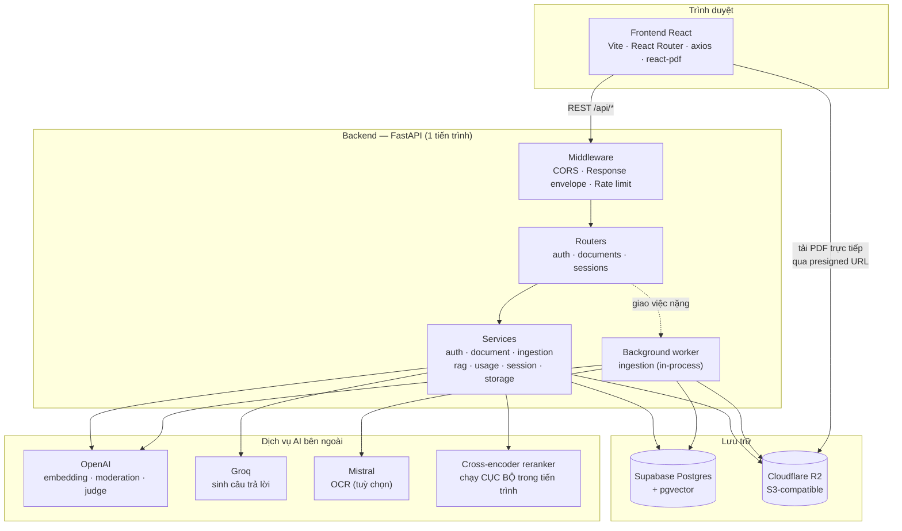
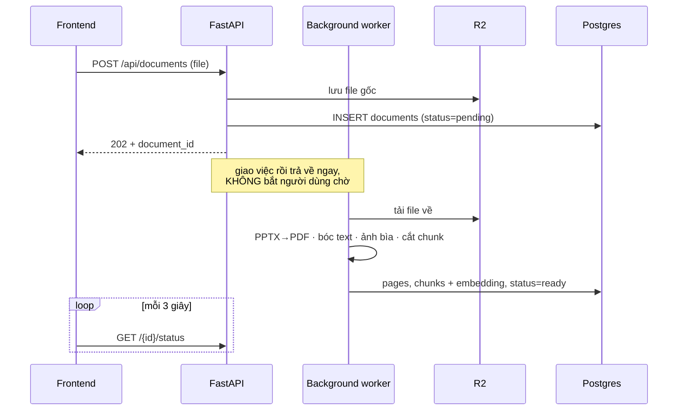
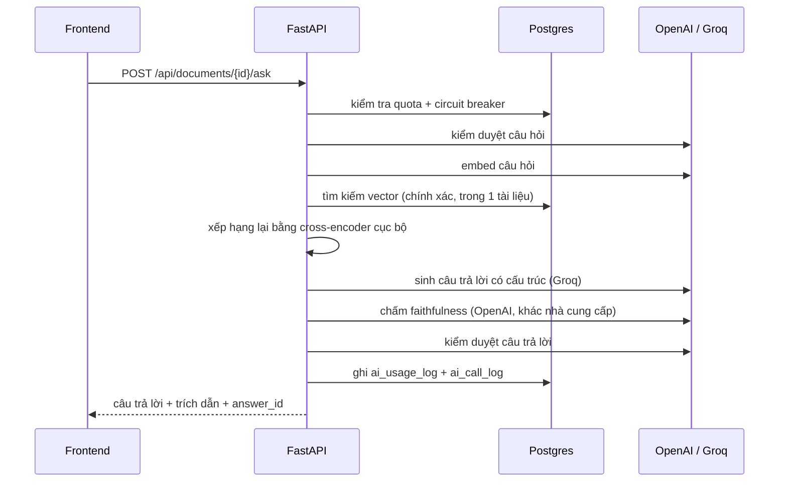

# Tổng quan hệ thống AI Tutor

> **Phạm vi tài liệu này:** trả lời câu hỏi *"hệ thống hoạt động thế nào ở mức tổng thể"*.
> Kế hoạch xây gì nằm ở [`development-plan/`](../development-plan/README.md); giải thích từng bước triển khai nằm ở [`explain-logic/`](../explain-logic/README.md).
>
> **Nguyên tắc:** tài liệu này chỉ mô tả những gì **thật sự có trong code** tại thời điểm viết (2026-08-23). Phần chưa làm được đánh dấu rõ ràng ở mục [Ranh giới](#ranh-giới-đã-có--đang-thiếu).

---

## 1. Hệ thống này giải quyết vấn đề gì

Sinh viên có slide bài giảng / tài liệu PDF nhưng đọc không hiểu, và hỏi ChatGPT thì nhận về câu trả lời chung chung **không bám vào tài liệu của mình**, thậm chí bịa.

AI Tutor giải bài toán đó bằng RAG (Retrieval-Augmented Generation): người dùng tải tài liệu lên, hệ thống bóc tách và đánh chỉ mục ngữ nghĩa, sau đó mọi câu trả lời đều **được sinh ra từ chính nội dung tài liệu** và **kèm trích dẫn số trang** để người học kiểm chứng ngược lại.

Hai đặc tính quyết định giá trị sản phẩm, và cũng là hai thứ phần lớn công sức đổ vào:

| Đặc tính | Nghĩa là gì | Bảo đảm bằng |
|---|---|---|
| **Grounded** (bám tài liệu) | Không bịa. Không biết thì nói không biết. | Faithfulness judge + retry + câu từ chối cố định |
| **Verifiable** (kiểm chứng được) | Mỗi ý đều chỉ ra được nó lấy từ trang nào | Structured citation, nhảy tới đúng trang PDF |

---

## 2. Các thành phần chính



**Điểm đáng chú ý trong sơ đồ:** frontend tải file PDF **thẳng từ R2**, không đi qua backend. Backend chỉ cấp một URL đã ký (presigned) có hạn 1 giờ. Đổi lại backend không phải làm proxy cho file hàng chục MB, nhưng cái giá là **bucket R2 phải có CORS policy riêng** — thiếu nó thì `curl` vẫn chạy tốt còn trình duyệt bị chặn, một lỗi chỉ lộ ra khi có frontend thật.

---

## 3. Phụ thuộc bên ngoài và vì sao chọn

| Dịch vụ | Dùng để làm gì | Vì sao chọn / đánh đổi |
|---|---|---|
| **Supabase Postgres + pgvector** | Toàn bộ dữ liệu quan hệ **và** vector embedding | Một DB cho cả hai thay vì thêm vector DB riêng (Pinecone/Qdrant): ít thành phần vận hành hơn, join trực tiếp giữa chunk và metadata. Đánh đổi: không có các tính năng chuyên sâu của vector DB chuyên dụng, và sẽ phải xem lại khi dữ liệu lớn hơn nhiều |
| **Cloudflare R2** | File gốc, bản PDF đã chuyển đổi, ảnh bìa | Tương thích S3 (dùng `boto3` sẵn), không tính phí egress — quan trọng vì frontend tải PDF trực tiếp |
| **OpenAI** | Embedding, moderation, chấm faithfulness, structured output | Embedding và judge cần **ổn định và nhất quán** hơn là rẻ; judge cố ý dùng nhà cung cấp **khác** với bên sinh câu trả lời để tránh "vừa đá bóng vừa thổi còi" |
| **Groq** | Sinh câu trả lời cuối | Miễn phí, rất nhanh, chất lượng đo được ngang OpenAI trên bộ dữ liệu thật. Đánh đổi đã trả giá thật: Groq **đã đổi/gỡ model 2 lần** giữa lúc đang phát triển |
| **Cross-encoder cục bộ** | Xếp hạng lại kết quả tìm kiếm | Chạy trong tiến trình, không tốn API. Đánh đổi: tốn RAM/CPU của chính server, và làm ảnh container nặng lên |
| **Mistral** | OCR cho PDF ảnh/scan | Chỉ dùng khi người dùng chọn chế độ `mistral_ocr`/`hybrid`, không phải đường đi mặc định |

---

## 4. Hai luồng chính

Chi tiết đầy đủ ở [`data-flow.md`](data-flow.md); đây là bản rút gọn để nắm hình dạng.

### 4.1 Nạp tài liệu (bất đồng bộ)



Ingest mất hàng chục giây tới vài phút nên **bắt buộc phải bất đồng bộ**. Frontend hỏi lại trạng thái theo chu kỳ (polling) — chỉ hỏi khi thật sự còn tài liệu đang xử lý, và dừng ngay khi tất cả đã xong.

### 4.2 Hỏi đáp (đồng bộ)



Chi tiết từng chốt kiểm soát ở [`ai-pipeline.md`](ai-pipeline.md).

---

## 5. Quan hệ giữa backend và phần AI

Điều đáng nhớ nhất: **phần AI không phải là một dịch vụ riêng**. Không có microservice AI, không có hàng đợi tác vụ, không có worker riêng biệt. Toàn bộ pipeline AI là **các hàm Python chạy trong cùng tiến trình FastAPI**, tập trung ở `app/services/rag_service.py`.

```
app/routers/documents.py          ← lớp HTTP: xác thực, hợp lệ hoá, dịch lỗi
        │
        ▼
rag_service.ask_for_user()        ← lớp bảo vệ tài nguyên: quota, ngân sách, circuit breaker
        │                            (đây LÀ hàm mà endpoint thật phải gọi)
        ▼
rag_service.ask()                 ← lớp chất lượng: retrieval, sinh, kiểm chứng
        │                            (không cần biết user là ai — nên script đánh giá
        ▼                             offline gọi thẳng được mà không tiêu quota của ai)
   Postgres / OpenAI / Groq
```

Tách `ask()` khỏi `ask_for_user()` là một quyết định có chủ đích: `ask()` có tới 3 nhánh trả về khác nhau, nhét thêm quota + ghi log vào trong sẽ phải lặp ở cả 3 nhánh và rất dễ sót một nhánh.

**Hệ quả cần biết:** vì AI chạy chung tiến trình, một câu hỏi nặng sẽ giữ một worker của web server trong vài giây. Ở quy mô hiện tại chấp nhận được; khi lượng truy cập tăng, đây là chỗ phải tách ra trước tiên.

---

## 6. Ranh giới: đã có / đang thiếu

Phần này tồn tại để không ai đọc tài liệu rồi tưởng hệ thống có những thứ nó chưa có.

### Đã chạy thật

- Xác thực đầy đủ (đăng ký, đăng nhập, refresh token thu hồi được, đăng xuất)
- Tải lên và nạp tài liệu PDF/PPTX end-to-end, có ảnh bìa trang 1
- Hỏi đáp RAG có trích dẫn, kèm toàn bộ lớp guardrail (kiểm duyệt 2 chiều, faithfulness, quota, circuit breaker, ghi log chi phí)
- Phản hồi 👍/👎 cho từng câu trả lời
- CRUD phiên hội thoại (tạo/liệt kê/xem/đổi tên/xoá)
- Frontend: đăng nhập, dashboard, màn workspace 3 panel với trình xem PDF thật

### Đang thiếu — đã có kế hoạch

| Thiếu | Hệ quả hiện tại | Kế hoạch |
|---|---|---|
| Gửi/đọc tin nhắn trong phiên | Hội thoại **không được lưu** — tải lại trang là mất | [Phase 6](../development-plan/phase-6-chat-sessions.md) bước 6.3–6.6 |
| Hiểu ngữ cảnh nhiều lượt | Hỏi nối tiếp *"giải thích rõ hơn"* sẽ tìm sai đoạn | Phase 6 bước 6.7–6.8 |
| Streaming (SSE) | Người dùng chờ im lặng vài giây rồi mới thấy toàn bộ câu trả lời | [Phase 7](../development-plan/phase-7-streaming.md) |
| Highlight vùng trong trang | Trích dẫn chỉ nhảy tới **trang**, chưa tô đúng đoạn | [Phase 8](../development-plan/phase-8-citation-highlight.md) — cần điền cột `bbox` |

### Cố ý KHÔNG làm (có số liệu chứng minh)

Những thứ này **có code trong repo nhưng không được nối vào `ask()`**, vì đã đo bằng dữ liệu thật và không đạt: hybrid search (BM25 + vector), query transformation / multi-query, semantic caching, scope enforcement bằng ngưỡng similarity, và hai dịch vụ rerank ngoài (Voyage, Jina). Giữ code lại làm bằng chứng cho quyết định, không phải rác.

### Chưa có, và cũng chưa cần

Không có agent, không có tool calling, không có bộ nhớ dài hạn xuyên phiên, không có multi-tenant, không có hàng đợi tác vụ bền vững. Nếu bạn đọc thấy "agent" ở đâu đó trong tài liệu khác — đó là mô tả sản phẩm tham khảo, không phải hệ thống này.

---

## 7. Đọc tiếp

| Câu hỏi | Đọc |
|---|---|
| Backend chia tầng thế nào, mỗi tầng chịu trách nhiệm gì? | [`backend-architecture.md`](backend-architecture.md) |
| Một câu hỏi đi qua bao nhiêu chốt AI trước khi tới người dùng? | [`ai-pipeline.md`](ai-pipeline.md) |
| Dữ liệu chảy qua đâu, biến đổi thế nào? | [`data-flow.md`](data-flow.md) |
| Sắp xây gì tiếp theo? | [`development-plan/`](../development-plan/README.md) |
| Vì sao từng bước lại code như vậy? | [`explain-logic/`](../explain-logic/README.md) |
