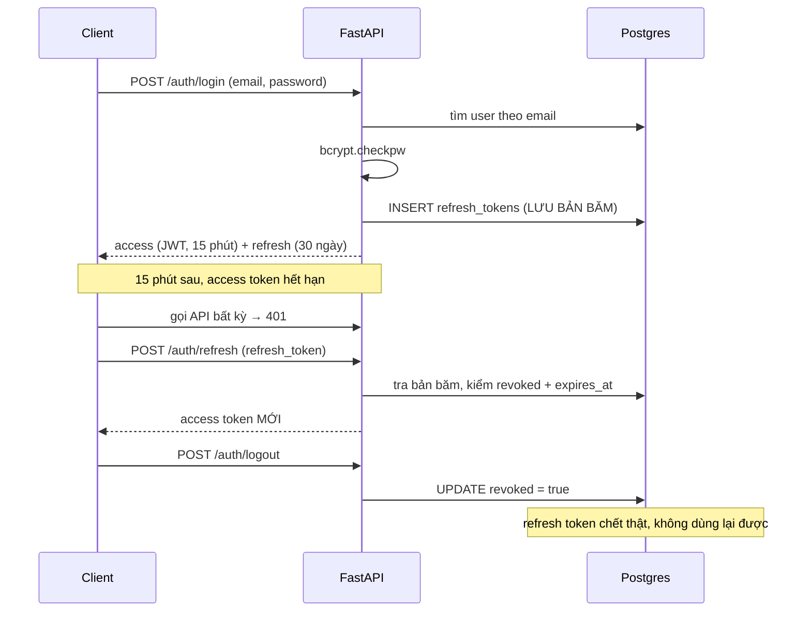

[← Tất cả engineering records](README.md)

# 001 — Xác thực

> **Trạng thái:** đang chạy production · Hoàn thành ở [Phase 1](../development-plan/phase-1-auth.md) và [Phase 1.5](../development-plan/phase-1.5-jwt-hardening.md)
> **Code:** [`auth_service.py`](../../app/services/auth_service.py) · [`routers/auth.py`](../../app/routers/auth.py) · [`dependencies.py`](../../app/dependencies.py) · [`models/refresh_token.py`](../../app/models/refresh_token.py)

---

## A. Cái gì và vì sao

### 1. Đã xây gì

Hệ thống xác thực đầy đủ cho một API không trạng thái: đăng ký, đăng nhập, làm mới phiên, đăng xuất **thu hồi được thật**, và một cách nhất quán để mọi endpoint biết "ai đang gọi".

Năm endpoint: `signup`, `login`, `refresh`, `logout`, `me`.

### 2. Vì sao phải xây

Không phải vì "app nào cũng cần login". Lý do cụ thể của hệ thống này: **mọi thứ trong AI Tutor đều thuộc về một người cụ thể** — tài liệu tải lên, phiên hội thoại, và quan trọng nhất là **hạn mức chi phí AI**.

Nếu không có danh tính người dùng thì không có gì để gắn quota vào, và toàn bộ lớp bảo vệ chi phí ở Phase 5.6 (hạn mức ngày, ngân sách tháng, circuit breaker) trở nên vô nghĩa — ai cũng có thể đốt tiền OpenAI/Groq của dự án. Xác thực ở đây không chỉ là bảo mật, nó là **điều kiện tiên quyết để kiểm soát chi phí**.

### 3. Nằm ở đâu trong hệ thống

```
Request ─▶ get_current_user (dependency)
                  │  giải mã JWT → tải User từ DB
                  ▼
             router ─▶ service ─▶ dữ liệu của ĐÚNG user đó
                                    │
                                    └─▶ quota / ngân sách gắn theo user_id
```

Xem [`backend-architecture.md`](../architecture/backend-architecture.md#3-xác-thực) để biết vị trí trong tầng kiến trúc. **Mọi thứ khác phụ thuộc vào mảng này**; bản thân nó không phụ thuộc vào mảng nào ngoài Postgres.

---

## B. Cách nó chạy

### 4. Luồng



### 5. Thành phần tham gia

| Thành phần | Vai trò | Hỏng thì sao |
|---|---|---|
| `bcrypt` | Băm mật khẩu (chậm có chủ đích) | Không có sẵn ⇒ không đăng ký/đăng nhập được |
| `python-jose` | Ký và giải mã JWT | Lộ `JWT_SECRET` ⇒ giả mạo được mọi access token |
| `secrets.token_urlsafe(32)` | Sinh refresh token ngẫu nhiên | Nguồn ngẫu nhiên yếu ⇒ đoán được token |
| Postgres (`refresh_tokens`) | Nơi duy nhất phiên đăng nhập tồn tại | DB chết ⇒ không refresh/logout được (access token vẫn chạy tới khi hết hạn) |
| `slowapi` | Giới hạn 5 lần/phút ở `/login` | Không có ⇒ dò mật khẩu bằng vét cạn |

---

## C. Vì sao thiết kế thế này

### 6 & 7. Lựa chọn và các phương án đã cân nhắc

**Quyết định lớn nhất: JWT ngắn hạn + refresh token lưu trong DB.**

| Phương án | Ưu | Nhược | Vì sao không chọn / chọn |
|---|---|---|---|
| **Session trong DB thuần** | Thu hồi tức thì, đơn giản | **Mỗi request phải tra DB** | Bỏ — API này còn phải gọi LLM, không nên cộng thêm một lượt tra DB vào mọi request |
| **JWT dài hạn, không refresh** | Không tra DB lần nào | **Không thu hồi được.** Đăng xuất chỉ là xoá token ở client — kẻ đã cầm token vẫn dùng tiếp | Bỏ — "đăng xuất" mà không thật sự đăng xuất là nói dối người dùng |
| **JWT ngắn (15') + refresh trong DB** | Request thường không tra DB; đăng xuất có hiệu lực thật | Phức tạp hơn; vẫn có **cửa sổ tối đa 15 phút** token cũ còn sống | ✅ **Đã chọn** |

Bản chất là chọn vị trí trên một cái trục: **tra DB mỗi request** (an toàn nhất, chậm nhất) ↔ **không tra bao giờ** (nhanh nhất, không thu hồi được). 15 phút là điểm cân bằng: đủ ngắn để thiệt hại tự giới hạn, đủ dài để không phải refresh liên tục.

**Quyết định thứ hai: refresh token lưu dưới dạng SHA-256, không phải bcrypt.**

Ngược với mật khẩu — và ngược có lý do. `bcrypt` cố ý **chậm** để chống vét cạn mật khẩu do người đặt (entropy thấp, hay dùng lại). Refresh token là 32 byte ngẫu nhiên từ `secrets`: **không thể vét cạn được ở bất kỳ tốc độ nào**. Dùng bcrypt ở đây chỉ tự làm chậm chính mình mà không đổi lấy an toàn nào.

Bài học tổng quát: **chọn hàm băm theo entropy của thứ được băm, không theo thói quen "cứ băm mật khẩu thì dùng bcrypt".**

**Quyết định thứ ba: sai gì cũng trả về cùng một lỗi.**

Sai email, sai mật khẩu, refresh token không tồn tại, refresh token của người khác — tất cả cùng một thông điệp. Phân biệt "email này chưa đăng ký" với "sai mật khẩu" là **tặng kẻ tấn công một công cụ dò danh sách người dùng**.

### 8. Đánh đổi — cả phần bất lợi

| Được | Mất |
|---|---|
| Request thường không tra DB | Access token bị lộ vẫn dùng được **tối đa 15 phút**, không cách nào chặn sớm |
| Đăng xuất có hiệu lực thật | Phải giữ thêm một bảng, thêm đường `/refresh`, client phải xử lý retry sau 401 |
| Nhiều thiết bị đăng nhập độc lập | Không có "đăng xuất mọi thiết bị" — dù DB đã đủ để thêm rẻ sau |
| SHA-256 nhanh cho refresh token | Người đọc code thoáng qua dễ tưởng là lỗ hổng; **bắt buộc phải có comment giải thích** |

**Những thứ cố ý KHÔNG làm** (ghi trong [Phase 1.5](../development-plan/phase-1.5-jwt-hardening.md), không phải quên):

- **Refresh token rotation + phát hiện đánh cắp** — chống một kiểu tấn công cụ thể, đổi lại phải xử lý token family và race condition. Chưa tương xứng ở quy mô này.
- **`jti` claim / thu hồi từng access token** — 15 phút đã tự giới hạn thiệt hại.
- **Refresh token qua httpOnly cookie** — an toàn hơn trước XSS, nhưng cần frontend phối hợp (CORS credentials, SameSite). Lúc đó chưa có frontend để kiểm chứng.

---

## D. Cái gì có thể hỏng

### 9. Phân loại theo mức ồn ào

| | Tình huống | Biểu hiện |
|---|---|---|
| 🔇 **ÂM THẦM** | `JWT_SECRET` mặc định `""` khi thiếu biến môi trường | Server vẫn **chạy bình thường**, token vẫn ký được — nhưng ai cũng ký được token hợp lệ. Không lỗi nào báo ra |
| 🔇 **ÂM THẦM** | Refresh token hết hạn không được dọn | Bảng phình vô hạn. Không sai chức năng, chỉ chậm dần |
| 🔊 **ỒN ÀO nhưng MUỘN** | Đồng hồ server lệch | Token hết hạn sớm/muộn bất thường, rất khó truy nguyên |
| 🔊 **ỒN ÀO NGAY** | Token sai/hết hạn, sai mật khẩu | 401 ngay tại biên |

Ô đầu tiên là điểm yếu thật đáng lo nhất, và **chưa được xử lý**: `config.py` khai `JWT_SECRET: str = ""`. Thiếu biến môi trường thì hệ thống vẫn khởi động ngon lành với secret rỗng. Cách sửa đúng là fail-fast lúc khởi động.

### 10. Bảo mật

- Mật khẩu: `bcrypt` có salt riêng mỗi lần
- Refresh token: chỉ lưu **bản băm**, DB bị lộ cũng không mạo danh được
- Không rò rỉ qua **mã lỗi**: mọi thất bại cùng một thông điệp
- Không rò rỉ qua **quyền sở hữu**: dùng refresh token của người khác cho **cùng lỗi** như token không tồn tại
- `/login` giới hạn 5 lần/phút

**Chưa xử lý:** so sánh mật khẩu có thể lộ qua **thời gian phản hồi** (email không tồn tại thì trả về ngay, không chạy bcrypt) — kênh phụ hẹp nhưng có thật.

### 11. Hiệu năng / mở rộng

- `bcrypt` cố ý tốn ~100ms CPU mỗi lần đăng nhập. Đúng như thiết kế, nhưng nghĩa là **đăng nhập ồ ạt sẽ ăn CPU**
- Mỗi request có xác thực = 1 lượt tra DB lấy `User`. Có thể bỏ nếu nhét đủ thông tin vào JWT, nhưng khi đó dữ liệu user sẽ **cũ** tới 15 phút
- `refresh_tokens` chỉ tăng, chưa bao giờ giảm — cần job dọn định kỳ

---

## E. Học được gì

### 12. Kiểm chứng bằng cách nào

Đo thật, không phải "đã test kỹ":

- 4/4 trường hợp refresh token: hợp lệ, sai, hết hạn, đã thu hồi
- Token hết hạn **đúng 15 phút** (verify bằng token thật, không tin cấu hình)
- Hai lần đăng nhập tạo **hai dòng độc lập** — nhiều thiết bị đúng như thiết kế
- Đăng xuất rồi thì refresh token đó **chết thật**
- Rate limit `/login` chặn ở lần thứ 6 trong một phút
- Trong lúc làm Phase 6: user B gọi vào tài nguyên của user A → **404**, và id bịa ra cũng **404** — không phân biệt được

**Chưa kiểm chứng:** hành vi khi `JWT_SECRET` rỗng, hành vi khi đồng hồ lệch, và kênh phụ về thời gian phản hồi.

### 13. Học được gì

1. **"Đăng xuất" là một quyết định kiến trúc, không phải một nút bấm.** JWT thuần không thu hồi được — muốn đăng xuất có hiệu lực thật thì **buộc** phải có trạng thái ở phía server. Không có đường vòng.
2. **Chọn hàm băm theo entropy của dữ liệu, không theo thói quen.** bcrypt cho mật khẩu (người đặt, entropy thấp), SHA-256 cho token ngẫu nhiên 32 byte. Dùng nhầm chiều nào cũng sai.
3. **Mã lỗi là kênh rò rỉ thông tin.** Nguyên tắc này khởi đầu ở auth rồi lan ra toàn hệ thống: `get_owned_document`, `get_owned_session`, feedback — tất cả đều trả 404 không phân biệt.
4. **Ghi lại thứ cố ý KHÔNG làm cũng có giá trị ngang thứ đã làm.** Bảng "bỏ qua có lý do" ở Phase 1.5 khiến sáu tháng sau không ai phải đoán xem đây là quyết định hay là sơ suất.

### 14. Câu hỏi còn để ngỏ

- **15 phút có đúng không?** Con số này chọn theo thông lệ, **chưa đo** tần suất refresh thực tế hay ảnh hưởng tới trải nghiệm.
- **Đã đến lúc chuyển refresh token sang httpOnly cookie chưa?** Lý do hoãn ("chưa có frontend") giờ không còn đúng — frontend đã có. Hiện đang để `localStorage`, tức là **XSS đọc được**.
- **Kênh phụ thời gian có khai thác được thật không?** Hay chỉ là mối lo lý thuyết ở quy mô này?

### 15. Cải tiến hợp lý — kèm điều kiện kích hoạt

| Cải tiến | Khi nào nên làm |
|---|---|
| **Fail-fast khi `JWT_SECRET` rỗng** | **Ngay.** Rẻ, và bịt đúng lỗi âm thầm nguy hiểm nhất ở mục 9 |
| Job dọn refresh token hết hạn | Khi bảng vượt vài chục nghìn dòng |
| Refresh token qua httpOnly cookie | Khi bắt đầu chuẩn bị lên production thật |
| "Đăng xuất mọi thiết bị" | Khi người dùng thật sự hỏi tới — DB đã sẵn sàng, chỉ là `revoke where user_id = X` |
| Rotation + phát hiện đánh cắp | Khi có dữ liệu nhạy cảm hơn slide bài giảng |

---

[← Tất cả engineering records](README.md) · [002 — Nạp tài liệu *(chưa viết)*]
