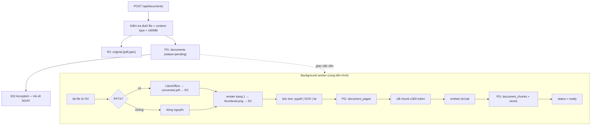

[← Tất cả engineering records](README.md)

# 002 — Nạp tài liệu

> **Trạng thái:** đang chạy production · Hoàn thành ở [Phase 2](../development-plan/phase-2-document-upload.md) và [Phase 3](../development-plan/phase-3-ingestion.md)
> **Code:** [`ingestion_service.py`](../../app/services/ingestion_service.py) · [`ingestion_worker.py`](../../app/workers/ingestion_worker.py) · [`document_service.py`](../../app/services/document_service.py) · [`storage_service.py`](../../app/services/storage_service.py)

---

## A. Cái gì và vì sao

### 1. Đã xây gì

Đường ống biến một file người dùng tải lên thành **dữ liệu tìm kiếm được bằng ngữ nghĩa**: nhận PDF/PPTX, chuyển đổi định dạng, bóc text theo trang, cắt thành chunk, tạo embedding, render ảnh bìa — chạy nền và báo tiến độ qua một máy trạng thái.

### 2. Vì sao phải xây

Đây là **điều kiện cần** của cả sản phẩm: không có chunk + embedding thì không có gì để retrieval tìm, và toàn bộ pipeline RAG không có đầu vào.

Quan trọng hơn về mặt kỹ thuật: **chất lượng ở đây chặn trên chất lượng của mọi thứ phía sau**. Cắt chunk tệ thì không thuật toán retrieval nào cứu được — reranker chỉ chọn được cái tốt nhất trong đám ứng viên đã có, nó không tạo ra được thông tin đã bị cắt hỏng.

### 3. Nằm ở đâu trong hệ thống

```
Upload ─▶ [nạp tài liệu] ─▶ document_chunks ─▶ [retrieval] ─▶ [RAG] ─▶ câu trả lời
             ▲                                    (004)        (003)
             │
   không có bước này thì mọi thứ bên phải đều không có đầu vào
```

Phụ thuộc vào: R2 (lưu file), OpenAI (embedding), LibreOffice (chuyển PPTX), Mistral (OCR, tuỳ chọn).

---

## B. Cách nó chạy

### 4. Luồng



Frontend hỏi lại `GET /{id}/status` mỗi 3 giây, **chỉ khi** còn tài liệu chưa xong:

```
pending ─▶ parsing ─▶ embedding ─▶ ready
                              └──▶ failed (kèm error_message)
```

### 5. Thành phần tham gia

| Thành phần | Vai trò | Hỏng thì sao |
|---|---|---|
| **R2** | Lưu file gốc, bản chuyển đổi, ảnh bìa | Không tải/ghi được ⇒ ingest hỏng, `status=failed` |
| **LibreOffice** (`soffice`) | PPTX → PDF | Không cài trên máy chủ ⇒ **mọi file PPTX đều hỏng**, PDF vẫn chạy |
| **OpenAI embedding** | `text-embedding-3-small` | Hết quota / lỗi mạng ⇒ ingest hỏng ở bước cuối, sau khi đã tốn công bóc text |
| **Mistral OCR** | Đọc slide dạng ảnh | Chỉ ảnh hưởng chế độ `mistral_ocr`/`hybrid` |
| **pypdfium2** | Render ảnh bìa | Có `try/except` riêng — hỏng thì **không** làm hỏng cả ingest |
| **tiktoken** | Đếm token khi cắt chunk | Chunk sai kích thước |

---

## C. Vì sao thiết kế thế này

### 6 & 7. Lựa chọn và phương án đã cân nhắc

**Quyết định 1 — PPTX chuyển sang PDF thay vì đọc trực tiếp.**

| Phương án | Vì sao chọn / bỏ |
|---|---|
| Đọc PPTX trực tiếp bằng `python-pptx` | Bỏ — sẽ có **hai** đường xử lý song song phải bảo trì, và trình duyệt vẫn cần PDF để hiển thị |
| **Chuyển sang PDF rồi dùng chung một đường** | ✅ Một pipeline duy nhất, và có sẵn file để xem |

Cái giá rất thật: phụ thuộc LibreOffice — một **phụ thuộc hệ thống nặng**, không phải thư viện Python. Và các tiến trình `soffice` chạy song song từng **tranh chấp profile mặc định** ("soffice is already running") dưới tải thật, phải tách profile riêng cho mỗi lần gọi.

**Quyết định 2 — ba chế độ bóc text, mặc định là chế độ rẻ nhất.**

`pypdf` (miễn phí, chỉ lấy text có sẵn) · `mistral_ocr` (đọc được cả hình/biểu đồ, **tốn tiền**) · `hybrid`.

Vì sao không mặc định OCR cho chắc: phần lớn slide bài giảng **đã có text thật**, OCR cho chúng là trả tiền cho việc không cần thiết. Vì sao không bỏ hẳn OCR: slide dạng ảnh scan thì `pypdf` trả về **rỗng** — và rỗng là loại lỗi âm thầm tệ nhất, tài liệu vẫn `ready` nhưng không tìm được gì.

Cho người dùng chọn lúc tải lên là cách né việc phải tự đoán.

**Quyết định 3 — cắt chunk theo cấu trúc văn bản, không cắt theo số ký tự cố định.**

Cắt theo đoạn trước; đoạn nào vượt 300 token thì tách tiếp theo câu; vẫn vượt thì mới gom tham lam. Cắt cứng theo ký tự sẽ **chặt đứt câu giữa chừng**, tạo ra chunk mà embedding của nó không đại diện cho ý nào trọn vẹn.

**Quyết định 4 — ảnh bìa render ở server, không phải ở trình duyệt.**

Bản đầu tiên để frontend tự render bằng `pdf.js`. Hệ quả đo được: mỗi lần mở dashboard, **7 card cùng tải và parse cả file PDF** (có file 20MB) chỉ để lấy một ảnh nhỏ — và lặp lại mỗi lần tải trang.

Chuyển sang render sẵn một lần lúc ingest: **48ms cho file 21.6MB / 83 trang**. Bundle frontend cũng giảm từ ~715KB + chunk worker 1MB xuống ~251KB vì không phải nạp `pdf.js` ở dashboard nữa.

### 8. Đánh đổi

| Được | Mất |
|---|---|
| Người dùng không phải chờ (202 ngay) | Không biết chắc khi nào xong, phải hỏi lại theo chu kỳ |
| Một pipeline cho mọi định dạng | Phụ thuộc LibreOffice cài sẵn trên máy chủ |
| Chọn được chế độ bóc text | Người dùng phải hiểu sự khác biệt — hoặc chấp nhận mặc định |
| Ảnh bìa nhanh, frontend nhẹ | Tốn thêm dung lượng R2 và thời gian ingest |
| Lưu text **hai lần** (`document_pages` + `document_chunks`) | Dư dữ liệu — nhưng cố ý: đổi chiến lược cắt chunk sau này **không phải OCR lại** (tức không tốn tiền lại) |

### Nợ kỹ thuật đã biết

**Background task không bền vững.** `BackgroundTasks` của FastAPI chạy trong **cùng tiến trình** web server. Server restart giữa chừng ⇒ **công việc biến mất vĩnh viễn**, không lỗi, không retry.

Đây không phải giả thuyết — **đã xảy ra thật**: một tài liệu kẹt ở `pending` với `created_at == updated_at` (chứng tỏ worker chưa chạy nổi bước đầu tiên), quay vòng vô hạn trên giao diện cho tới khi xoá và tải lại.

---

## D. Cái gì có thể hỏng

### 9. Phân loại theo mức ồn ào

| | Tình huống | Biểu hiện |
|---|---|---|
| 🔇 **ÂM THẦM** | Server restart lúc đang ingest | Tài liệu kẹt ở `pending` **vĩnh viễn**. Không lỗi, không log, không retry. Đã xảy ra thật |
| 🔇 **ÂM THẦM** | PDF scan chạy chế độ `pypdf` | Text rỗng ⇒ 0 chunk ⇒ `status=ready` nhưng **hỏi gì cũng không tìm thấy** |
| 🔇 **ÂM THẦM** | Xoá tài liệu | Chỉ `original.*` bị xoá khỏi R2; `converted.pdf` và `thumbnail.png` **ở lại vĩnh viễn** — rò rỉ lưu trữ thật, chưa vá |
| 🔊 **ỒN ÀO NGAY** | Lỗi OCR, embedding, LibreOffice | `status=failed` + `error_message`, hiện lên giao diện |
| 🔊 **ỒN ÀO NGAY** | File sai định dạng / quá 50MB | 4xx ngay tại biên |

Ba ô đầu đều **âm thầm**, và đó là đặc điểm chung của xử lý bất đồng bộ: **không ai đứng đó chờ để nhận lỗi**.

### 10. Bảo mật

- Kiểm tra **cả đuôi file lẫn `content-type`**, không tin riêng cái nào
- Giới hạn 50MB — chặn cả nhầm lẫn lẫn cố ý làm nghẽn
- Đường dẫn R2 chứa `user_id`, và mọi truy cập đi qua `get_owned_document`
- File gốc **không bao giờ được phục vụ trực tiếp** — luôn qua presigned URL có hạn

**Chưa xử lý:** nội dung file không bị quét gì (PDF độc hại, zip bomb). Rủi ro giới hạn vì file chỉ được parse chứ không thực thi, nhưng `pypdf`/LibreOffice trên input thù địch không phải là chỗ an toàn tuyệt đối.

### 11. Hiệu năng / mở rộng

- Ingest **tranh CPU với việc phục vụ request** — cùng tiến trình. Một file 80 trang OCR sẽ làm chậm mọi người dùng khác
- LibreOffice tốn RAM đáng kể và khởi động chậm
- Embedding gọi theo lô, nhưng vẫn là điểm nghẽn mạng cho tài liệu lớn
- Không có giới hạn số ingest chạy đồng thời — nhiều người cùng tải file lớn là có vấn đề

---

## E. Học được gì

### 12. Kiểm chứng bằng cách nào

- Chạy end-to-end với PDF và PPTX thật, đủ ba chế độ bóc text
- Ảnh bìa: đo **48ms/21.6MB/83 trang**, tải về mở bằng PIL xác nhận PNG hợp lệ 480×271
- Xác nhận R2 trả **206 Partial Content** cho Range request — nghĩa là trình xem PDF chỉ tải phần cần
- Backfill ảnh bìa cho tài liệu cũ: 10/11 thành công, 1 hỏng do file gốc đã mất khỏi R2 (dữ liệu rác có sẵn)

**Chưa kiểm chứng:** hành vi khi nhiều ingest chạy song song ở tải cao; PDF hỏng/thù địch; tài liệu rất lớn (>100 trang OCR).

### 13. Học được gì

1. **Ranh giới bất đồng bộ nên đặt ngay sau khi dữ liệu đã an toàn.** Trả `202` sau khi file đã ở R2 và đã có dòng trong DB — sớm hơn thì mất dữ liệu, muộn hơn thì bắt người dùng chờ.
2. **Dư thừa có chủ đích khác với dữ liệu rác.** Lưu text hai lần trông lãng phí, cho tới khi cần đổi chiến lược cắt chunk — lúc đó nó tiết kiệm cả tiền OCR lẫn thời gian.
3. **Đẩy việc tính toán về phía server nếu kết quả bất biến.** Ảnh bìa trang 1 không bao giờ đổi; bắt mỗi trình duyệt tự tính lại mỗi lần tải trang là lãng phí có hệ thống.
4. **Xử lý nền không bền vững là món nợ có lãi.** Nó rẻ lúc viết và đắt lúc mất dữ liệu — và cái giá đó **đã trả một lần**.
5. **`try/except` hẹp quanh phần phụ.** Ảnh bìa hỏng thì tài liệu vẫn dùng được; đặt nó ngoài `try` chung sẽ biến một khiếm khuyết thẩm mỹ thành hỏng cả tài liệu.

### 14. Câu hỏi còn để ngỏ

- **300 token/chunk có đúng không?** Chọn theo thông lệ, **chưa đo** ảnh hưởng tới Recall — trong khi retrieval đã được đo rất kỹ.
- **Có nên tự phát hiện PDF scan** rồi gợi ý dùng OCR, thay vì để người dùng chọn mù?
- **Ingest lại tài liệu** khi cần đổi chiến lược chunk — chưa có đường nào làm việc này.

### 15. Cải tiến — kèm điều kiện kích hoạt

| Cải tiến | Khi nào |
|---|---|
| **Xoá cả `converted.pdf` + `thumbnail.png`** khi xoá tài liệu | **Ngay** — lỗi thật, sửa vài dòng |
| **Watchdog cho tài liệu kẹt** (quá N phút không đổi trạng thái ⇒ chạy lại hoặc đánh `failed`) | Sớm — bịt lỗi âm thầm số 1 mà không cần đổi hạ tầng |
| Cảnh báo khi ingest ra **0 chunk** | Sớm — bịt lỗi âm thầm số 2 |
| Hàng đợi bền vững (Celery/RQ/job table) | Trước khi lên production thật |
| Đo và tinh chỉnh kích thước chunk | Khi retrieval chạm trần và cần cải thiện tiếp |

---

[← Tất cả engineering records](README.md) · [001 — Xác thực](001-authentication.md)
