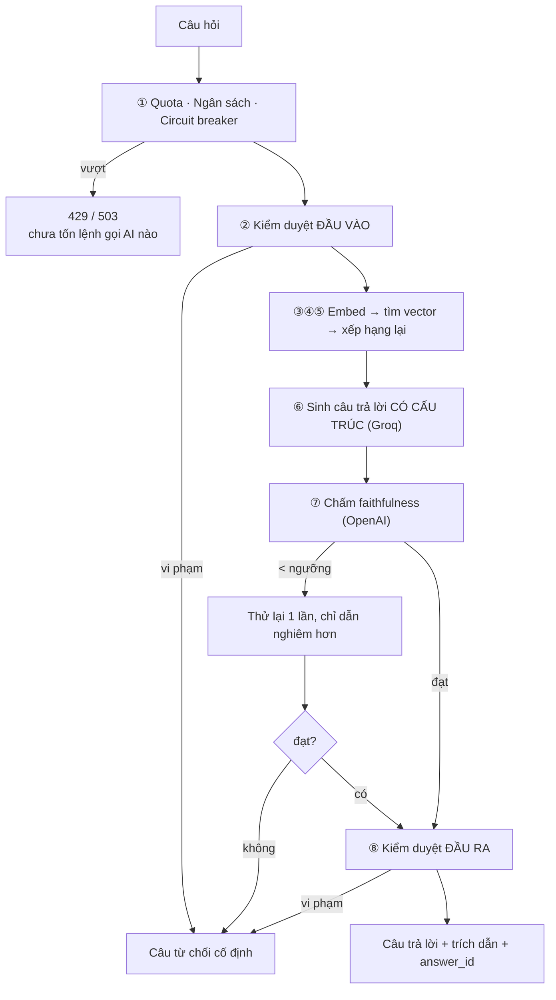

[← Tất cả engineering records](README.md)

# 003 — RAG pipeline

> **Trạng thái:** đang chạy production · Hoàn thành ở [Phase 5](../development-plan/phase-5-rag-orchestrator.md), nâng cấp ở [5.5](../development-plan/phase-5.5-advanced-rag.md) và [5.6](../development-plan/phase-5.6-guardrails-observability.md)
> **Code:** [`rag_service.py`](../../app/services/rag_service.py) (`ask`, `ask_for_user`, `build_prompt`, `score_faithfulness`)
> **Liên quan:** [004 — Retrieval](004-retrieval.md) (bước ④⑤) · [005 — Guardrails](005-guardrails-observability.md) (bước ①②⑧)

---

## A. Cái gì và vì sao

### 1. Đã xây gì

Bộ điều phối biến một câu hỏi thành **câu trả lời bám tài liệu, có trích dẫn kiểm chứng được** — hoặc thành một lời từ chối trung thực nếu không đủ căn cứ.

Đây là bản ghi về **khung điều phối và cơ chế chống bịa**. Phần truy hồi chi tiết ở [004](004-retrieval.md), phần bảo vệ chi phí ở [005](005-guardrails-observability.md).

### 2. Vì sao phải xây

Hỏi thẳng ChatGPT về slide bài giảng cho ra câu trả lời **nghe rất hợp lý mà không kiểm chứng được** — và đôi khi sai hẳn. Với gia sư học tập, đó là kiểu hỏng tệ nhất: sinh viên **không có cách nào phát hiện** mình vừa học phải thông tin bịa.

Nên hai đặc tính quyết định giá trị sản phẩm không phải "trả lời hay", mà là:

- **Grounded** — không biết thì nói không biết
- **Verifiable** — mỗi ý chỉ được ra nó lấy từ trang nào

Toàn bộ độ phức tạp của pipeline này tồn tại để mua hai đặc tính đó.

### 3. Nằm ở đâu trong hệ thống

```
router (HTTP)
   │
   ▼
ask_for_user()   ← lớp bảo vệ tài nguyên: quota, ngân sách, circuit breaker, ghi log
   │                (ĐÂY là hàm mà endpoint thật phải gọi)
   ▼
ask()            ← lớp chất lượng: truy hồi, sinh, kiểm chứng
   │                (không biết user là ai ⇒ script đánh giá offline gọi thẳng được,
   ▼                 không tiêu quota của ai)
Postgres · OpenAI · Groq
```

Tách hai lớp là quyết định có chủ đích: `ask()` có **ba nhánh trả về** khác nhau; nhét quota và ghi log vào trong sẽ phải lặp ở cả ba, và rất dễ sót một nhánh.

---

## B. Cách nó chạy

### 4. Luồng — bảy chốt



Điểm cần nhớ: **mọi đường thất bại đều đổ về CÙNG một câu từ chối cố định**. Nếu mỗi loại từ chối có thông điệp riêng, người dùng sẽ dò được đâu là ranh giới kiểm duyệt và đâu là "không có trong tài liệu".

### 5. Thành phần tham gia

| Thành phần | Vai trò | Vì sao là nó |
|---|---|---|
| **OpenAI** — embedding | Vector hoá câu hỏi | Cần **cùng model** đã dùng lúc ingest, nếu không vector không so được |
| **Groq** — sinh | Viết câu trả lời | Miễn phí, rất nhanh, chất lượng đo được ngang OpenAI |
| **OpenAI** — giám khảo | Chấm faithfulness | **Cố ý khác nhà cung cấp** với bên sinh |
| **OpenAI** — moderation | Lọc hai đầu | Model chuyên dụng, rẻ |
| **Cross-encoder cục bộ** | Xếp hạng lại | Xem [004](004-retrieval.md) |
| **Postgres + pgvector** | Kho chunk | Xem [004](004-retrieval.md) |

---

## C. Vì sao thiết kế thế này

### 6 & 7. Lựa chọn và phương án đã cân nhắc

**Quyết định 1 — dùng LLM thứ hai chấm điểm câu trả lời, thay vì tin câu trả lời đầu tiên.**

| Phương án chống bịa | Vì sao chọn / bỏ |
|---|---|
| Chỉ dặn trong prompt *"chỉ dùng ngữ cảnh"* | Bỏ — cần thiết nhưng **không đủ**; model vẫn trôi khi ngữ cảnh mỏng |
| So khớp chuỗi giữa câu trả lời và ngữ cảnh | Bỏ — phạt oan cách diễn đạt lại đúng nghĩa, mà vẫn bỏ lọt câu bịa dùng đúng từ vựng |
| **LLM giám khảo chấm faithfulness** | ✅ Đánh giá được **ý nghĩa**, không chỉ mặt chữ |

**Và giám khảo phải là nhà cung cấp khác.** Cùng một model vừa viết vừa tự chấm có thiên kiến hệ thống — nó không nhìn ra lỗi của chính nó. Ở đây Groq sinh, **OpenAI chấm**.

**Quyết định 2 — dưới ngưỡng thì thử lại một lần, vẫn hỏng thì từ chối.**

Ba lựa chọn khi faithfulness không đạt: trả về nguyên (nhanh, sai), thử lại vô hạn (đắt, có thể không bao giờ đạt), hoặc **thử lại đúng một lần rồi từ chối**.

Chọn cái thứ ba, và nguyên tắc đằng sau là: **thà im lặng còn hơn nói sai**. Với gia sư học tập, một câu bịa nghe hợp lý tai hại hơn nhiều so với "tôi không tìm thấy trong tài liệu".

**Quyết định 3 — structured output thay vì regex đọc lại văn bản.**

Bản đầu: model viết văn xuôi có chèn `"[Trang 14]"`, rồi regex quét chuỗi đó ra để dựng trích dẫn. Hỏng ngay khi model đổi cách viết đôi chút — `"trang 14"`, `"[Trang 14, 15]"`, hay quên hẳn.

Bản hiện tại: model trả về `AnswerSegment[]`, mỗi đoạn kèm `page_number` **có kiểu**. Câu trả lời được ghép từ các segment, trích dẫn dựng thẳng từ `page_number`. **Không còn parse chuỗi ở bất kỳ đâu.**

Bài học tổng quát: **nếu đang regex một chuỗi do LLM sinh ra, hãy hỏi model trả về dữ liệu có kiểu.**

**Quyết định 4 — kiểm duyệt cả hai đầu, không chỉ đầu vào.**

Đầu vào sạch **không đảm bảo** đầu ra sạch: tài liệu người dùng tải lên có thể chứa nội dung không phù hợp và bị trích ra ngoài ý muốn. Bỏ qua bước ⑧ khi câu trả lời đã là câu từ chối — không cần kiểm duyệt một câu do chính mình viết.

### 8. Đánh đổi

| Được | Mất |
|---|---|
| Không bịa (có kiểm chứng) | **Mỗi câu hỏi tốn 3–5 lệnh gọi LLM**, không phải 1 |
| Trích dẫn đáng tin | Độ trễ cao hơn hẳn — không stream được, người dùng chờ im lặng |
| Giám khảo độc lập | Phụ thuộc **hai** nhà cung cấp thay vì một |
| Thà im lặng còn hơn nói sai | Đôi khi từ chối câu **thật ra trả lời được** — false negative có thật |
| Structured output | Ràng buộc vào model hỗ trợ structured output |

**Cái giá lớn nhất là độ trễ.** Bảy chốt tuần tự, mỗi chốt một vòng gọi mạng. Đây chính là lý do [Phase 7](../development-plan/phase-7-streaming.md) (streaming) tồn tại — nhưng streaming lại xung đột với ⑧ (kiểm duyệt cần **toàn bộ** câu trả lời), một mâu thuẫn chưa giải.

---

## D. Cái gì có thể hỏng

### 9. Phân loại theo mức ồn ào

| | Tình huống | Biểu hiện |
|---|---|---|
| 🔇 **ÂM THẦM** | Endpoint gọi nhầm `ask()` thay vì `ask_for_user()` | Lọt **toàn bộ** quota/ngân sách/circuit breaker, không ghi `ai_usage_log`. Câu trả lời vẫn đúng ⇒ không ai phát hiện cho tới khi nhận hoá đơn |
| 🔇 **ÂM THẦM** | Sửa prompt mà quên tăng `prompt_version` | Số liệu hai phiên bản **trộn lẫn**, mọi so sánh chất lượng thành vô nghĩa. *(Đã bịt bằng kiểm tra hash tự động — xem [005](005-guardrails-observability.md))* |
| 🔇 **ÂM THẦM** | Ngưỡng faithfulness đặt quá thấp | Câu bịa lọt qua, trông y hệt câu đúng |
| 🔊 **ỒN ÀO nhưng MUỘN** | Giám khảo đổi hành vi chấm theo thời gian | Tỷ lệ từ chối trôi dần — chỉ thấy nếu có theo dõi số liệu |
| 🔊 **ỒN ÀO NGAY** | Nhà cung cấp gỡ model, hết quota | 5xx. **Đã xảy ra 2 lần** — Groq đổi/gỡ model giữa lúc phát triển |

Ô đầu tiên nguy hiểm đặc biệt vì **hỏng mà kết quả vẫn đúng**. Nó là lý do plan Phase 6 phải ghi hẳn một dòng cảnh báo "endpoint mới BẮT BUỘC gọi `ask_for_user()`".

### 10. Bảo mật

- **Prompt injection gián tiếp**: tài liệu người dùng tải lên **là dữ liệu không tin được** — nó có thể chứa câu ra lệnh cho model. Prompt phân tách rõ ràng ngữ cảnh và chỉ dẫn (Phase 5.5.8)
- **Jailbreak trực tiếp**: đã vá qua **2 vòng thử thật** (Phase 5.6.2)
- Kiểm duyệt hai chiều
- Mọi câu từ chối dùng **cùng một câu chữ** — không lộ ranh giới kiểm duyệt
- Chỉ tìm trong tài liệu của **đúng người gọi** (`get_owned_document` trước khi vào pipeline)

### 11. Hiệu năng / mở rộng

- **3–5 lệnh gọi LLM tuần tự** — độ trễ vài giây là bản chất, không phải bug
- Chạy **cùng tiến trình web** ⇒ một câu hỏi giữ một worker vài giây
- Reranker cục bộ tốn RAM/CPU của chính server
- Chưa có cache ở bất kỳ tầng nào (semantic caching đã đo và **loại** — xem [004](004-retrieval.md))

---

## E. Học được gì

### 12. Kiểm chứng bằng cách nào

- **Golden dataset thật** 43 câu trên `b1-full.pdf` + 79 câu trên 5 file nhỏ, có đáp án người viết
- Faithfulness đo trên dữ liệu thật để **chọn ngưỡng**, không đặt theo cảm tính
- Prompt injection: 2 vòng tấn công thật, vá, rồi tấn công lại
- Structured citation: xác nhận trích dẫn dựng từ `page_number` có kiểu, không còn regex
- `prompt_version` có **kiểm tra hash tự động** — sửa prompt mà quên tăng version thì hệ thống báo lỗi

**Chưa kiểm chứng:** hành vi khi ngữ cảnh rất dài; tài liệu đa ngôn ngữ trộn lẫn; giám khảo có trôi theo thời gian không.

### 13. Học được gì

1. **"Không bịa" là thuộc tính phải xây, không phải thứ prompt tốt tự cho.** Dặn dò trong prompt là cần nhưng không đủ; phải có một bước **kiểm chứng độc lập** rồi hành động theo kết quả.
2. **Người chấm không được là người viết.** Nguyên tắc này đúng với cả LLM lẫn con người.
3. **Nếu đang regex output của LLM thì thiết kế đang sai.** Hỏi model trả về dữ liệu có kiểu.
4. **Mọi đường thất bại phải trông giống hệt nhau.** Thông điệp lỗi khác nhau là kênh rò rỉ — cùng nguyên tắc đã dùng ở [001](001-authentication.md) với 404 vs 403.
5. **Tách "lớp chất lượng" khỏi "lớp bảo vệ tài nguyên".** Nhờ vậy script đánh giá offline chạy được mà không tiêu quota của ai — nhưng phải trả giá bằng một lỗi âm thầm nếu gọi nhầm hàm.

### 14. Câu hỏi còn để ngỏ

- **Ngưỡng faithfulness có đúng không?** Đã đo một lần để chọn, **chưa đo lại** sau khi prompt và model đã đổi vài lần.
- **Tỷ lệ từ chối oan là bao nhiêu?** Biết hệ thống từ chối khi không chắc, **không biết** nó từ chối oan bao nhiêu phần trăm — cần đối chiếu 👍/👎 thật với các lượt bị từ chối.
- **Streaming và kiểm duyệt đầu ra hoà giải thế nào?** ⑧ cần toàn bộ câu trả lời, streaming lại hiện dần. Buffer theo cụm token? Chấp nhận rủi ro? Chưa quyết.

### 15. Cải tiến — kèm điều kiện kích hoạt

| Cải tiến | Khi nào |
|---|---|
| Đo lại ngưỡng faithfulness | Sau mỗi lần đổi model sinh hoặc prompt lớn |
| Theo dõi tỷ lệ từ chối theo thời gian | Ngay khi có đủ lưu lượng thật — dữ liệu đã có sẵn trong `ai_usage_log` |
| Fallback nhà cung cấp LLM | Đã có **2 bằng chứng thật** là rủi ro; nên làm trước khi lên production |
| Streaming | [Phase 7](../development-plan/phase-7-streaming.md) — nhưng phải giải quyết mâu thuẫn với ⑧ trước |
| Hiểu ngữ cảnh nhiều lượt | [Phase 6](../development-plan/phase-6-chat-sessions.md) bước 6.7 — hiện hỏi nối tiếp sẽ truy hồi sai |

---

[← Tất cả engineering records](README.md) · [004 — Retrieval](004-retrieval.md)
