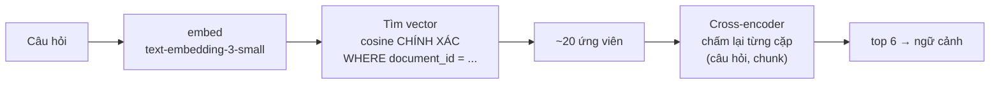

[← Tất cả engineering records](README.md)

# 004 — Retrieval

> **Trạng thái:** đang chạy production · Đo và chốt ở [Phase 5.5](../development-plan/phase-5.5-advanced-rag.md)
> **Code:** [`rag_service.py`](../../app/services/rag_service.py) (`similarity_search`, `rerank_search`, và các hàm đã đo nhưng **không** nối vào `ask()`)
> **Liên quan:** [003 — RAG pipeline](003-rag-pipeline.md) (đây là bước ④⑤)

---

## A. Cái gì và vì sao

### 1. Đã xây gì

Bước tìm ra **những đoạn văn bản nào trong tài liệu có khả năng chứa câu trả lời**. Hai giai đoạn: tìm ứng viên bằng vector, rồi xếp hạng lại bằng cross-encoder.

Nhưng phần đáng học của bản ghi này không phải cái đang chạy — mà là **năm kỹ thuật đã đo và bốn trong số đó bị loại**.

### 2. Vì sao phải xây

Retrieval là **trần chất lượng** của cả hệ thống RAG. Nếu đoạn chứa câu trả lời không lọt vào ngữ cảnh, thì model dù giỏi đến đâu cũng chỉ có hai lựa chọn: bịa, hoặc nói không biết. **Không có prompt nào cứu được retrieval hỏng.**

Nên đây là chỗ đáng đầu tư đo lường nhất trong toàn dự án.

### 3. Nằm ở đâu

```
câu hỏi ─▶ embed ─▶ [④ tìm vector] ─▶ [⑤ xếp hạng lại] ─▶ ngữ cảnh ─▶ sinh câu trả lời
                          │                                              ▲
                          └──── chọn sai ở đây ───▶ mọi thứ sau đều vô nghĩa
```

---

## B. Cách nó chạy

### 4. Luồng



**Vì sao hai giai đoạn** chứ không dùng thẳng cross-encoder: cross-encoder phải chạy **một lần cho mỗi cặp** (câu hỏi, chunk) — với hàng trăm chunk thì quá chậm. Vector search rẻ nên dùng để **lọc thô** xuống ~20, rồi mới trả giá cho bước chấm kỹ.

Đây là mẫu hình chung: **lọc rẻ và rộng trước, chấm đắt và chính xác sau.**

### 5. Thành phần tham gia

| Thành phần | Vai trò |
|---|---|
| `text-embedding-3-small` (OpenAI) | Vector hoá — **phải cùng model** đã dùng lúc ingest |
| Postgres + `pgvector` | Kho vector, toán tử cosine |
| `cross-encoder/mmarco-mMiniLMv2-L12-H384-v1` | Xếp hạng lại, chạy **cục bộ** trong tiến trình |

---

## C. Vì sao thiết kế thế này

### 6 & 7. Năm kỹ thuật, một được nhận

Đây là phần cốt lõi của bản ghi. Mỗi kỹ thuật đều được đo trên **golden dataset thật** trước khi quyết định.

| Kỹ thuật | Số liệu đo được | Quyết định |
|---|---|---|
| **Reranking** (cross-encoder) | Tài liệu khó (43 câu): `Recall@6` **0.837 → 0.953**, `MRR` **0.715 → 0.900**.<br/>Tài liệu dễ (79 câu): 1.000 → 1.000, MRR 0.914 → 0.921 | ✅ **NHẬN** |
| **Hybrid search** (BM25 + vector) | Tài liệu dễ: `Recall@6` 1.000 → **1.000**, `MRR` 0.914 → **0.914** — *giống hệt tới từng chữ số*.<br/>Tài liệu khó: `Recall@6` → **0.987**, `MRR` → **0.903** — **TỆ HƠN** baseline | ❌ Loại |
| **Query transformation / multi-query** | `Recall@6` 0.867 → **0.867**, `MRR` 0.867 → **0.867** — không đổi, mà tốn thêm 1 lệnh gọi LLM mỗi câu hỏi | ❌ Loại |
| **Semantic caching** | Câu **cùng ý**: similarity 0.6385–0.8063.<br/>Câu **khác ý**: 0.4890–0.7724. → **Hai dải CHỒNG LẤN nhau** | ❌ Loại |
| **Rerank API ngoài** | Voyage: 15/15 đúng nhưng giới hạn **3 lượt/phút**.<br/>Jina: 13/15, độ trễ **668ms – 50.955ms**.<br/>Cục bộ: 12/15, **73–337ms** ổn định | ❌ Giữ bản cục bộ |

**Vì sao reranking thắng.** Vector search so **hai embedding đã nén sẵn, tính độc lập với nhau** — nó không bao giờ "đọc" câu hỏi và đoạn văn cùng lúc. Cross-encoder thì đưa **cả cặp vào cùng một lượt** nên bắt được liên hệ tinh tế hơn. Đổi lại nó chậm hơn nhiều — nên chỉ dùng được ở giai đoạn hai.

**Vì sao hybrid search thua — và đây là bài học đắt nhất.** BM25 khớp **từ khoá**; tiếng Việt không tách từ bằng khoảng trắng theo nghĩa từ vựng, nên BM25 mặc định của Postgres tách sai. Làm hybrid search tốt cho tiếng Việt cần đầu tư hạ tầng NLP tiếng Việt thật (`underthesea`...). **Một kỹ thuật kinh điển trong mọi tài liệu về RAG lại không hoạt động ở đây, vì ngôn ngữ.**

**Vì sao semantic caching bị loại — bài học về việc đọc số liệu đúng cách.** Ý tưởng: câu hỏi gần giống thì trả lại câu trả lời cũ. Nghe rất hợp lý. Nhưng đo thật thì **dải similarity của "cùng ý" và "khác ý" chồng lấn nhau** — nghĩa là **không tồn tại ngưỡng nào** vừa bắt được cache hit thật vừa không trả nhầm câu trả lời của một câu hỏi khác. Không phải "chưa tinh chỉnh đủ", mà là **tín hiệu này không tách biệt được**.

Cùng dạng lỗi đó xuất hiện lần nữa ở scope enforcement (5.6.3): câu ngoài phạm vi kiểu *"1+1 bằng mấy?"* lại có similarity **cao hơn** câu hỏi hợp lệ thật.

### Quyết định 6 — bỏ hẳn index vector

Điều phản trực giác nhất: **không có index vector nào cả.**

Ban đầu có `idx_chunks_embedding` kiểu `ivfflat (embedding vector_cosine_ops) WITH (lists = 100)` từ schema gốc. Phát hiện tình cờ khi viết một hàm phụ: câu hỏi **hợp lệ, có đáp án thật** trong tài liệu 113 chunk lại trả về **0 kết quả**.

Truy nguyên từng bước:

1. Thử lại bằng `similarity_search` (hàm đã chạy production) → **cũng 0 chunk**
2. Raw SQL bỏ qua hẳn SQLAlchemy → **vẫn 0 dòng**, kể cả quét toàn bảng
3. `SET enable_indexscan = off` (ép Postgres quét tuần tự) → **có 3 kết quả, khoảng cách hợp lý 0.43–0.46**
4. → Dữ liệu vẫn ở đó. **Lỗi nằm ở index.**
5. Đo lại toàn bộ 43 câu: **6/43 (14%)** bị index trả về 0 kết quả sai

Nguyên nhân: `lists=100` là mặc định hợp lý **cho hàng chục nghìn dòng**; ở đây chỉ có hàng trăm, nên mỗi cụm quá nhỏ và tìm kiếm xấp xỉ trượt hoàn toàn.

**Đã sửa bằng cách xoá hẳn index**, không phải tinh chỉnh lại `lists`. Ở quy mô này, quét tuần tự trong phạm vi một tài liệu vừa nhanh vừa **chính xác tuyệt đối**. Verify sau khi sửa: **0/43 lỗi**.

### 8. Đánh đổi

| Được | Mất |
|---|---|
| Reranking cải thiện rõ trên tài liệu khó | Thêm ~73–337ms mỗi câu hỏi; model chiếm RAM/CPU của chính server |
| Reranker cục bộ ổn định | Ảnh triển khai nặng hơn nhiều, khó scale ngang |
| Không index ⇒ chính xác tuyệt đối | Quét tuần tự — **sẽ** thành vấn đề khi số chunk mỗi tài liệu tăng nhiều |
| Chỉ tìm trong 1 tài liệu | Không tìm chéo nhiều tài liệu được (hiện chưa cần) |
| Loại 4 kỹ thuật ⇒ hệ thống đơn giản | Đã tốn thời gian xây và đo cả 4 — **nhưng đó là chi phí để BIẾT, không phải lãng phí** |

---

## D. Cái gì có thể hỏng

### 9. Phân loại theo mức ồn ào

| | Tình huống | Biểu hiện |
|---|---|---|
| 🔇 **ÂM THẦM** | Index xấp xỉ cấu hình sai | **Đã xảy ra**: mất 14% kết quả, không lỗi nào báo. Câu trả lời chỉ… tệ hơn |
| 🔇 **ÂM THẦM** | Đổi model embedding mà không ingest lại | Vector cũ và mới **không cùng không gian** ⇒ retrieval rác, không exception |
| 🔇 **ÂM THẦM** | Cắt chunk hỏng lúc ingest | Retrieval "đúng" nhưng nội dung vô nghĩa |
| 🔊 **ỒN ÀO NGAY** | OpenAI embedding lỗi | Exception, request hỏng |

Ba trong bốn dòng là **âm thầm** — và đó là đặc điểm của retrieval nói chung: **nó không bao giờ ném lỗi, nó chỉ trả về kết quả tệ hơn.** Đây chính là lý do phải có golden dataset và đo định kỳ; không có nó thì không có cách nào biết retrieval đang xuống cấp.

### 10. Bảo mật

- Luôn có `WHERE document_id = ...`, và `document_id` đã qua `get_owned_document` — **không thể** truy hồi chéo tài liệu người khác
- Chunk trả về được đưa thẳng vào prompt ⇒ là **dữ liệu không tin được** (prompt injection gián tiếp), xử lý ở [003](003-rag-pipeline.md)

### 11. Hiệu năng / mở rộng

- **Quét tuần tự** — hiện đủ nhanh vì luôn giới hạn trong một tài liệu (hàng trăm chunk). Sẽ thành nghẽn khi tài liệu lớn hơn nhiều
- **Reranker cục bộ** giữ model trong RAM, chấm ~20 cặp mỗi câu hỏi
- Khi nào cần index lại: khi số chunk **mỗi tài liệu** đủ lớn để quét tuần tự chậm thấy rõ. Lúc đó nên cân nhắc **HNSW** (chính xác hơn ivfflat ở quy mô nhỏ-vừa), và **phải đo lại recall sau khi bật**

---

## E. Học được gì

### 12. Kiểm chứng bằng cách nào

Phương pháp lặp lại cho **mọi** kỹ thuật, không có ngoại lệ:

```
1. Dựng golden dataset thật (43 câu khó + 79 câu dễ, đáp án người viết)
2. Đo baseline           → Recall@6, MRR
3. Cài kỹ thuật mới
4. Đo lại trên ĐÚNG bộ đó
5. Tốt hơn → nhận. Không tốt hơn → LOẠI, và ghi lại số liệu
```

Bước 5 là bước khó nhất về mặt tâm lý — bỏ đi thứ vừa mất công xây.

### 13. Học được gì

1. **Đo trước, tin sau. Kể cả với kỹ thuật "ai cũng bảo là tốt".** Hybrid search có mặt trong hầu hết tài liệu về RAG, và ở đây nó **tệ hơn** baseline. Bối cảnh (tiếng Việt, tài liệu học thuật, quy mô nhỏ) quan trọng hơn danh tiếng của kỹ thuật.
2. **Hai dải chồng lấn nghĩa là tín hiệu không dùng được — đừng đi tìm ngưỡng.** Bài học từ semantic caching, lặp lại y hệt ở scope enforcement. Khi phân bố của hai lớp trùm lên nhau, **không tồn tại** ngưỡng tốt; tinh chỉnh thêm chỉ là tự lừa mình.
3. **Index xấp xỉ đánh đổi độ chính xác lấy tốc độ — ở quy mô nhỏ bạn trả giá mà không nhận lại gì.** Và tệ hơn: nó hỏng **âm thầm**.
4. **Khi kết quả vô lý, nghi ngờ hạ tầng chứ đừng chỉ nghi ngờ thuật toán.** Cách cô lập được lỗi index là **ép Postgres bỏ index** rồi so — chứ không phải sửa hàm truy vấn.
5. **Lọc rẻ trước, chấm đắt sau.** Mẫu hình dùng lại được ở rất nhiều nơi ngoài retrieval.
6. **Code bị loại vẫn có giá trị.** Giữ lại `hybrid_search`, `multi_query_search`, `voyage_rerank_scores` trong repo (không nối vào `ask()`) là bằng chứng cho quyết định — để sáu tháng sau không ai thử lại một cách mù quáng.

### 14. Câu hỏi còn để ngỏ

- **Kích thước chunk 300 token có tối ưu không?** Retrieval được đo rất kỹ, nhưng **tham số ingest thì chưa** — mà nó chặn trên retrieval.
- **Ngưỡng 0.837 → 0.953 còn giữ được không?** Đo trên một tài liệu; chưa biết với tài liệu khác chủ đề/ngôn ngữ.
- **Hybrid search có thắng nếu có tách từ tiếng Việt thật?** Chưa thử, vì chi phí hạ tầng lớn.
- **Số ứng viên đưa vào rerank (~20) có đúng không?** Chưa quét thử các giá trị khác.

### 15. Cải tiến — kèm điều kiện kích hoạt

| Cải tiến | Khi nào |
|---|---|
| Đo lại golden dataset định kỳ | Sau mỗi lần đổi model embedding hoặc chiến lược chunk |
| Index HNSW + **đo lại recall ngay sau khi bật** | Khi số chunk mỗi tài liệu khiến quét tuần tự chậm thấy rõ |
| Quét thử kích thước chunk và số ứng viên rerank | Khi cần cải thiện tiếp mà không muốn thêm thành phần mới |
| Hybrid search với tách từ tiếng Việt | Chỉ khi có bằng chứng câu hỏi dạng từ khoá đang bị bỏ lọt |
| Tìm chéo nhiều tài liệu | Khi sản phẩm cần hỏi trên cả một môn học thay vì một file |

---

[← Tất cả engineering records](README.md) · [003 — RAG pipeline](003-rag-pipeline.md) · [005 — Guardrails](005-guardrails-observability.md)
