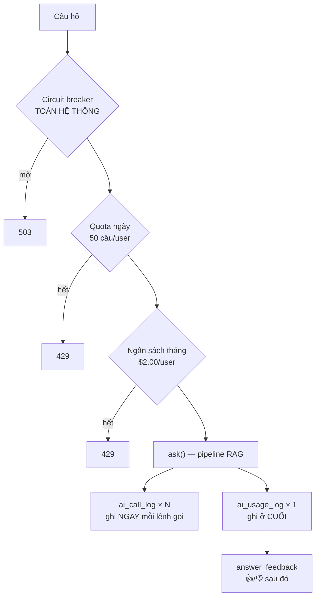

[← Tất cả engineering records](README.md)

# 005 — Guardrails & Observability

> **Trạng thái:** đang chạy production · Hoàn thành 12/12 mục ở [Phase 5.6](../development-plan/phase-5.6-guardrails-observability.md)
> **Code:** [`usage_service.py`](../../app/services/usage_service.py) · [`rag_service.ask_for_user`](../../app/services/rag_service.py) · [`models/ai_usage.py`](../../app/models/ai_usage.py)
> **Liên quan:** [003 — RAG pipeline](003-rag-pipeline.md) (đây là bước ①②⑧ và lớp ghi log)

---

## A. Cái gì và vì sao

### 1. Đã xây gì

Hai nhóm năng lực thường bị gộp làm một nhưng thực ra khác nhau:

- **Guardrails** — *ngăn điều xấu xảy ra*: hạn mức câu hỏi/ngày, ngân sách tiền/tháng, circuit breaker toàn hệ thống, kiểm duyệt hai chiều, phòng vệ jailbreak
- **Observability** — *biết điều gì đã xảy ra*: ghi log từng lệnh gọi AI, tổng hợp mỗi lượt hỏi, phiên bản prompt có kiểm tra tự động, và phản hồi 👍/👎 thật từ người dùng

### 2. Vì sao phải xây

**Guardrails** — một hệ thống RAG là một hệ thống **tiêu tiền của người khác theo yêu cầu của người lạ**. Không có hạn mức thì một vòng lặp lỗi ở client, hay một người dùng tò mò, đủ để đốt hết ngân sách API trong vài giờ. Đây không phải rủi ro lý thuyết — nó là hệ quả trực tiếp của việc mở một endpoint gọi LLM ra Internet.

**Observability** — câu hỏi *"prompt mới có tốt hơn không?"* nghe đơn giản nhưng **không trả lời được** nếu không chuẩn bị từ trước. Cần biết đồng thời: phiên bản prompt nào, faithfulness bao nhiêu, tốn bao nhiêu tiền, và **người dùng có hài lòng không** — cho từng câu trả lời một. Không ghi lại lúc nó xảy ra thì mãi mãi mất.

### 3. Nằm ở đâu

```
                    ask_for_user()   ← guardrails BỌC NGOÀI
                    ┌──────────────────────────────┐
   câu hỏi ─────────│  ① circuit breaker (hệ thống)│
                    │  ① quota ngày (user)          │
                    │  ① ngân sách tháng (user)     │
                    │        │                      │
                    │        ▼                      │
                    │     ask()  ← ② ⑧ kiểm duyệt   │
                    │        │      nằm TRONG        │
                    │        ▼                      │
                    │  ghi ai_usage_log             │
                    └──────────────────────────────┘
                              │
        ai_call_log ◀─────────┘────────▶ answer_feedback
```

---

## B. Cách nó chạy

### 4. Luồng



**Thứ tự ba chốt không phải ngẫu nhiên.** Circuit breaker kiểm tra **trước** quota vì nó bảo vệ **mọi người dùng**, không riêng ai — chặn sớm hơn thì đúng phạm vi hơn. Và cả ba đều chạy **trước khi tốn một lệnh gọi AI nào**.

### 5. Thành phần tham gia

| Thành phần | Vai trò |
|---|---|
| `ai_usage_log` | Một dòng mỗi **lượt hỏi**: user, chi phí, faithfulness, grounded |
| `ai_call_log` | Một dòng mỗi **lệnh gọi AI**: model, độ trễ, token, prompt, phiên bản prompt |
| `answer_feedback` | 👍/👎 + lý do tuỳ chọn, FK **cứng** tới `ai_usage_log` |
| OpenAI moderation | Lọc hai chiều |
| `call_group_id` | Sợi chỉ nối `ai_call_log` ↔ `ai_usage_log` ↔ `answer_feedback` |

---

## C. Vì sao thiết kế thế này

### 6 & 7. Lựa chọn và phương án đã cân nhắc

**Quyết định 1 — ba lớp hạn mức khác nhau, không phải một.**

| Lớp | Ngưỡng | Chặn cái gì mà lớp khác không chặn được |
|---|---|---|
| Quota ngày (user) | 50 câu | Một người dùng xài quá nhiều |
| Ngân sách tháng (user) | $2.00 | **Số câu hỏi không tỉ lệ với chi phí** — câu dài + retry tốn gấp nhiều lần câu ngắn |
| Circuit breaker (hệ thống) | 30 request **hoặc** $0.05 / 5 phút | Bất thường đột biến, **kể cả từ nhiều user cùng lúc** |

Chỉ có quota theo số câu thì một người hỏi 50 câu cực dài vẫn đốt gấp nhiều lần dự tính. Chỉ có ngân sách theo user thì một cuộc tấn công phân tán qua nhiều tài khoản vẫn lọt. **Ba lớp phủ ba bề mặt tấn công khác nhau.**

**Quyết định 2 — `ai_call_log` dùng liên kết MỀM, `answer_feedback` dùng FK CỨNG.**

Nghe như không nhất quán, nhưng khác nhau về **thứ tự ghi**:

- `ai_call_log` ghi **trong lúc** `ask()` đang chạy — tức trước khi dòng `ai_usage_log` (cha) tồn tại. FK cứng sẽ báo lỗi ngay. Nên dùng `call_group_id` sinh ở đầu `ask()` làm liên kết mềm.
- `answer_feedback` chỉ ghi **sau khi** người dùng đã nhận câu trả lời — dòng cha chắc chắn đã commit từ lâu. Không có vấn đề thứ tự ⇒ dùng FK thật, chặt chẽ hơn và tự dọn khi xoá.

Bài học: **chọn FK cứng hay mềm theo thứ tự ghi thực tế, không theo sở thích về độ chặt chẽ.**

**Quyết định 3 — feedback gắn vào `ai_usage_log`, không phải `chat_messages`.**

Lúc đó `chat_messages` chưa có luồng nào ghi vào. Nhưng lý do chính không phải vậy: `ai_usage_log` **đã có sẵn** `grounded`, `faithfulness_score`, `prompt_version`. Gắn feedback vào đúng bảng đó nghĩa là **đánh giá thật của người dùng đối chiếu trực tiếp được với tín hiệu chất lượng tự động**, không phải join thêm hệ thống nào.

**Quyết định 4 — `prompt_version` có kiểm tra hash tự động.**

Đánh số phiên bản prompt bằng tay có một lỗi âm thầm chắc chắn xảy ra: **sửa prompt mà quên tăng số**. Khi đó số liệu của hai phiên bản trộn lẫn và **mọi so sánh chất lượng trở thành vô nghĩa** — mà không có dấu hiệu nào.

Nên hệ thống băm nội dung prompt và đối chiếu với hash đã ghi cho phiên bản đó; lệch là **báo lỗi ngay lúc khởi động**. Đây là ví dụ mẫu của việc **biến lỗi âm thầm thành lỗi ồn ào**.

**Quyết định 5 — chỉ giữ MỘT ý kiến hiện tại cho mỗi (câu trả lời, user).**

`UniqueConstraint(ai_usage_log_id, user_id)` + cập nhật tại chỗ khi đổi ý, thay vì lưu lịch sử nhiều dòng. Mục tiêu là biết **tỷ lệ hài lòng**, không phải theo dõi ai đổi ý mấy lần. Cho phép nhiều dòng sẽ làm **sai lệch mọi con số gộp** — một người bấm 👍 rồi 👎 rồi 👍 bị đếm thành 3 lượt.

### 8. Đánh đổi

| Được | Mất |
|---|---|
| Không thể đốt ngân sách ngoài kiểm soát | Người dùng thật có thể **bị chặn oan** khi ngưỡng đặt thấp |
| Trả lời được "prompt mới có tốt hơn không" | Mỗi lượt hỏi ghi thêm **N+1 dòng** vào DB |
| Ghi log chi tiết | `ai_call_log` lưu cả prompt (đã cắt bớt) — **tăng nhanh**, chưa có cơ chế dọn |
| Kiểm duyệt hai chiều | Thêm 2 lệnh gọi API mỗi câu hỏi |
| Kiểm tra hash prompt | Sửa prompt là **buộc** phải tăng version — hơi phiền, nhưng cố ý |

**Ngưỡng đặt theo suy luận, không phải theo đo lường.** Comment trong `config.py` ghi thẳng điều này. $2.00/tháng và 30 request/5 phút là ước lượng từ quy mô đã biết, **chưa hiệu chỉnh** bằng lưu lượng thật — và cần được xem lại khi có người dùng thật.

---

## D. Cái gì có thể hỏng

### 9. Phân loại theo mức ồn ào

| | Tình huống | Biểu hiện |
|---|---|---|
| 🔇 **ÂM THẦM** | Endpoint gọi `ask()` thay vì `ask_for_user()` | **Toàn bộ** guardrails bị bỏ qua, không ghi log. Câu trả lời vẫn đúng ⇒ chỉ phát hiện khi nhận hoá đơn |
| 🔇 **ÂM THẦM** | Ngưỡng đặt quá cao | Guardrail tồn tại nhưng không bao giờ kích hoạt — cảm giác an toàn giả |
| 🔇 **ÂM THẦM** | `ai_call_log` ghi hỏng | Số liệu quan sát thiếu, không ai để ý vì tính năng vẫn chạy |
| 🔊 **ỒN ÀO NGAY** | Vượt hạn mức | 429/503 kèm thông điệp rõ ràng |
| 🔊 **ỒN ÀO NGAY** | Sửa prompt quên tăng version | **Báo lỗi lúc khởi động** — đúng như thiết kế |

Dòng cuối đáng chú ý: đây là lỗi **đã được cố ý chuyển từ âm thầm sang ồn ào**. Dòng đầu thì ngược lại — vẫn âm thầm, và là lý do plan Phase 6 phải ghi hẳn cảnh báo bằng chữ in hoa.

### 10. Bảo mật

- Kiểm duyệt **hai chiều** — đầu vào sạch không đảm bảo đầu ra sạch
- Jailbreak trực tiếp: vá qua **2 vòng tấn công thật**
- Prompt injection gián tiếp: tài liệu người dùng là dữ liệu không tin được
- Mọi câu từ chối dùng **cùng một câu chữ** — không lộ ranh giới kiểm duyệt
- Feedback cho câu trả lời của người khác → **cùng 404** như câu không tồn tại
- `ai_call_log` **cắt bớt** prompt trước khi lưu — giảm lượng dữ liệu người dùng nằm trong log

### 11. Hiệu năng / mở rộng

- Ba lần tra DB **trước** mỗi câu hỏi (breaker, quota, ngân sách) — rẻ so với chi phí LLM, nhưng vẫn là 3 lượt
- Circuit breaker quét cửa sổ 5 phút mỗi lần gọi ⇒ cần index đúng khi bảng lớn
- `ai_call_log` là bảng tăng nhanh nhất trong hệ thống, **chưa có chính sách lưu trữ/dọn**
- Ghi log nằm **trên đường đi chính** (không bất đồng bộ) ⇒ DB chậm thì câu hỏi chậm theo

---

## E. Học được gì

### 12. Kiểm chứng bằng cách nào

- **12/12 mục** của Phase 5.6 đều test với DB thật
- Feedback: 5/5 gồm cả trường hợp **đổi ý** (cập nhật tại chỗ, không nhân đôi) và **user B feedback cho câu của A** → 404
- Thống kê theo `prompt_version`: kịch bản 3 câu (1 👍, 1 👎, 1 **chưa** feedback) → `n_questions=3` nhờ **OUTER JOIN**; dùng INNER JOIN sẽ báo sai thành 2, làm mất câu chưa feedback khỏi **toàn bộ** thống kê kể cả các cột không liên quan
- Jailbreak: tấn công thật, vá, tấn công lại — 2 vòng
- Circuit breaker và quota: chạm ngưỡng thật rồi xác nhận 429/503

**Chưa kiểm chứng:** ngưỡng có phù hợp với lưu lượng thật không (chưa có); hành vi khi DB chậm; `ai_call_log` tăng tới mức nào thì có vấn đề.

### 13. Học được gì

1. **Guardrail phải chạy trước khi tiêu tiền.** Đặt kiểm tra hạn mức sau lệnh gọi LLM đầu tiên là đã trả tiền cho request lẽ ra phải chặn.
2. **Nhiều lớp hạn mức phủ nhiều bề mặt khác nhau.** Quota theo số lượng không thay được ngân sách theo tiền; cả hai không thay được circuit breaker toàn hệ thống.
3. **Observability phải thiết kế TRƯỚC khi cần.** Không thể trả lời hồi tố "prompt cũ tốt hơn hay mới tốt hơn" nếu lúc đó không ghi `prompt_version`.
4. **Biến lỗi âm thầm thành lỗi ồn ào bất cứ khi nào có thể.** Kiểm tra hash prompt là ví dụ mẫu: một lỗi con người chắc chắn sẽ mắc, được biến thành lỗi khởi động không thể bỏ qua.
5. **FK cứng hay mềm là câu hỏi về thứ tự ghi, không phải về độ chặt chẽ.**
6. **INNER JOIN trong truy vấn thống kê là cái bẫy im lặng.** Nó âm thầm loại bỏ các dòng chưa có dữ liệu liên quan khỏi **toàn bộ** bảng kết quả — kể cả những cột chẳng liên quan gì.

### 14. Câu hỏi còn để ngỏ

- **Ngưỡng có đúng không?** Tất cả đặt theo suy luận, **chưa hiệu chỉnh** bằng lưu lượng thật. 50 câu/ngày có quá ít với người học thật sự?
- **Bao nhiêu phần trăm bị chặn oan?** Chưa đo tỷ lệ người dùng hợp lệ chạm hạn mức.
- **`ai_call_log` tăng tới đâu?** Chưa có chính sách lưu trữ, chưa biết ngưỡng cần dọn.
- **Có ai bấm 👍/👎 không?** Cơ chế đã có nhưng **chưa có dữ liệu thật** để biết tỷ lệ tham gia.

### 15. Cải tiến — kèm điều kiện kích hoạt

| Cải tiến | Khi nào |
|---|---|
| Hiệu chỉnh ngưỡng bằng lưu lượng thật | Ngay khi có người dùng thật — dữ liệu đã sẵn trong `ai_usage_log` |
| Chính sách dọn/lưu trữ `ai_call_log` | Khi bảng vượt vài triệu dòng |
| Ghi log bất đồng bộ | Nếu đo thấy ghi log ảnh hưởng độ trễ thấy rõ |
| Cảnh báo khi guardrail kích hoạt bất thường | Khi lên production — hiện phải tự đi xem log |
| Fallback nhà cung cấp LLM (5.6.13) | Đã hoãn có chủ đích, nhưng **có 2 bằng chứng thật** rằng rủi ro là thật |
| Bảng theo dõi chất lượng theo thời gian | Khi đủ dữ liệu để đường xu hướng có ý nghĩa |

---

[← Tất cả engineering records](README.md) · [003 — RAG pipeline](003-rag-pipeline.md) · [004 — Retrieval](004-retrieval.md)
